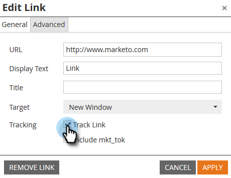

# Disabilita tracciamento per un collegamento e-mail {#disable-tracking-for-an-email-link}

A volte non si desidera abilitare il **URL di tracciamento Marketo** su un collegamento in un’e-mail. Questa opzione è utile quando la pagina di destinazione non supporta i parametri URL e può causare l’interruzione del collegamento.

1. Seleziona l’e-mail e fai clic su **Modifica bozza**.

   

1. Fai doppio clic sulla sezione modificabile contenente il collegamento.

   

1. Fai clic sul collegamento in questione, quindi fai clic sul pulsante **Inserisci/Modifica collegamento** pulsante .

   

1. Nella finestra a comparsa Modifica collegamento, deseleziona la **Traccia collegamento** casella di controllo.

   

1. Noterai la **Includi mkt_tok box** scompare. Fai clic su **Applica**.

   

   >[!TIP]
   >
   >Deseleziona **Includi mkt_tok** consentirà comunque il tracciamento del collegamento, ma dopo il reindirizzamento, l’URL di destinazione non includerà il parametro della stringa di query mkt_tok. Questo parametro viene utilizzato da Marketo Landing Pages e Munchkin per garantire il corretto tracciamento delle attività delle persone (ad esempio quando una persona annulla l’abbonamento a un’e-mail). È consigliabile evitare di utilizzare questa funzione a meno che non si visualizzi un comportamento strano sul sito web a causa della presenza del parametro.

1. Fai clic su **Salva**.

   

   >[!TIP]
   >
   >Disabilitare il tracciamento dei clic per un collegamento in un messaggio e-mail **template**? Usa questo formato:
   >`<a class="mktNoTrack" href="https://www.mywebsite.com">This link does not have tracking</a>`\
   >Se hai bisogno di aiuto per implementare questa funzionalità, consulta lo sviluppatore web.

Bello! Ora hai disattivato il tracciamento per un collegamento.
