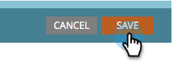

# Disattiva tracciamento per un collegamento e-mail {#disable-tracking-for-an-email-link}

A volte non si desidera abilitare l&#39; **URL tracciamento marketing** su un collegamento in un messaggio e-mail. Questa funzione è utile quando la pagina di destinazione non supporta i parametri dell’URL e potrebbe causare un collegamento interrotto.

1. Selezionate il messaggio e-mail e fate clic su **Modifica bozza**.

   

1. Fare doppio clic sulla sezione modificabile che contiene il collegamento.

   

1. Fare clic sul collegamento in questione, quindi fare clic sul pulsante **Inserisci/Modifica collegamento**.

   

1. Nella finestra a comparsa Modifica collegamento, deselezionate la casella di controllo **Collegamento traccia**.

   

1. Noterete che la **Includi mkt_tok box** scompare. Fare clic su **Applica**.

   

   >[!TIP]
   >
   >Se si deseleziona solo **Includi mkt_tok** il collegamento continuerà a essere tracciato, ma dopo il reindirizzamento l&#39;URL di destinazione non includerà il parametro della stringa di query mkt_tok. Questo parametro viene utilizzato da Marketo Landing Pages e Munchkin per garantire il corretto tracciamento delle attività delle persone (come nel caso in cui una persona annulla la sottoscrizione da un&#39;e-mail). È consigliabile evitare di utilizzare questa funzione a meno che non si verifichino comportamenti strani sul sito Web a causa della presenza del parametro.

1. Fare clic su **Salva**.

   

   >[!TIP]
   >
   >Disabilitare il monitoraggio dei clic per un collegamento in un messaggio e-mail **template**? Utilizzate questo formato:
   >`<a class="mktNoTrack" href="https://www.mywebsite.com">This link does not have tracking</a>`\
   >Se avete bisogno di aiuto per l&#39;implementazione di questo progetto, rivolgetevi al vostro sviluppatore Web.

Bello! Ora hai disattivato il tracciamento per un collegamento.
