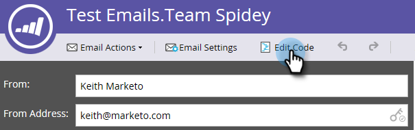

# Modificare l’HTML di un’e-mail {#edit-an-emails-html}

A volte può essere necessario modificare il HTML sottostante di un’e-mail. A volte puoi utilizzare un sistema esterno per progettare e generare il codice dell’e-mail. In entrambi i casi, puoi importare e/o modificare facilmente il codice dall’editor e-mail.

## Modifica HTML {#edit-html}

1. Selezionare l&#39;indirizzo di posta elettronica e fare clic su **[!UICONTROL Edit Draft]**.

   

1. Fai clic su **[!UICONTROL Edit Code]**.

   

1. Apporta le modifiche necessarie. Al termine, fai clic su **[!UICONTROL Save]**.

   

   >[!NOTE]
   >
   >Cambia quello che vuoi. È possibile sostituire l&#39;intero HTML o apportare modifiche minori.

1. Fai clic sul menu a discesa **[!UICONTROL Code Actions]** per scaricare il codice come file .html, allineare il file CSS o convalidare il HTML.

   

   >[!NOTE]
   >
   >La best practice per le e-mail è di allineare tutti gli stili. Diversi client di posta elettronica non supportano CSS nella sezione `<head>`.

## Interruzione di un’e-mail dal relativo modello {#breaking-an-email-from-its-template}

Queste modifiche al codice **non** interrompono un&#39;e-mail dal relativo modello:

* Modifica del contenuto di qualsiasi modulo (inclusa l’aggiunta di nuovi elementi all’interno del modulo)
* Aggiunta di un nuovo modulo al contenitore
* Eliminazione di un modulo dal contenitore

* Modifica degli attributi specifici di mkto (ad esempio, &quot;mktoName&quot; o &quot;mktoImgUrl&quot;) di qualsiasi elemento al di fuori di un modulo
* Modifica del contenuto di qualsiasi elemento (testo formattato, immagine, video ecc.) all’esterno di un modulo

Le operazioni che è possibile eseguire nell&#39;editor di codice **interromperanno** l&#39;e-mail dal relativo modello:

* Modifica di elementi nel codice all&#39;esterno di un elemento o di un modulo
* Aggiunta o modifica di attributi non mkto (ad esempio, &quot;id&quot; o &quot;style&quot;) di qualsiasi elemento al di fuori di un modulo
* Eliminazione di un elemento esterno a un modulo

## Cerca codice {#search-code}

Utilizza la funzionalità Codice di ricerca per trovare e sostituire in modo efficiente il contenuto nel codice HTML dell’e-mail.

1. Nel codice dell&#39;e-mail, fai clic su **[!UICONTROL Search Code]**.

   

1. Immettere l&#39;elemento che si desidera trovare e fare clic su **[!UICONTROL Find Next]** per eseguire la ricerca in avanti o su **[!UICONTROL Find Previous]** per eseguire la ricerca all&#39;indietro. È inoltre possibile scegliere di **[!UICONTROL Replace]** e **[!UICONTROL Replace All]**.

   

1. Al termine, fai clic su **[!UICONTROL Close]**.

   

   >[!NOTE]
   >
   >Il codice di ricerca è disponibile anche nell&#39;[editor modelli e-mail](/help/marketo/product-docs/email-marketing/general/email-editor-2/create-an-email-template.md).

È consigliabile continuare a modificare le e-mail utilizzando la funzionalità integrata di Marketo, ma questo editor di codice offre flessibilità in caso di necessità.
