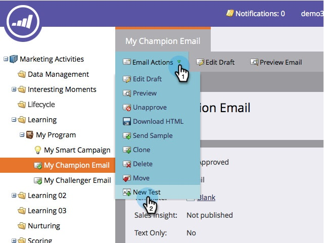

# Aggiungi un campione e-mail/Challenger {#add-an-email-champion-challenger}

È consigliabile testare tutte le e-mail che utilizzi frequentemente per assicurarti che funzionino. Un modo è quello di confrontare l&#39;efficacia di un&#39;e-mail con altre versioni, o sfidanti. In un test campione/sfida, puoi testare l’intera e-mail, l’oggetto o l’indirizzo del mittente.

L’e-mail esistente che stai testando è considerata il campione. Tutte le varianti create all’interno di un test sono considerate come sfidanti. È possibile determinare la percentuale di persone che ricevono il contenuto campione o il contenuto dello sfidante. Se hai definito più sfidanti, saranno distribuiti equamente tra i gruppi di sfidanti.

Ecco come iniziare.

>[!PREREQUISITES]
>
>* [Creare un programma](/help/marketo/product-docs/core-marketo-concepts/programs/creating-programs/create-a-program.md)
>* [Creare un messaggio e-mail](/help/marketo/product-docs/email-marketing/general/creating-an-email/create-an-email.md)

>[!CAUTION]
>
>Le e-mail di Champion/Challenger funzionano solo con campagne di trigger e flussi di programmi di coinvolgimento. Per la posta in batch, utilizzare il programma di posta elettronica [Funzionalità di test A/B](/help/marketo/product-docs/email-marketing/email-programs/email-program-actions/email-test-a-b-test/add-an-a-b-test.md).

1. Vai a **Attività di marketing**.

   

1. Trova e seleziona un messaggio e-mail.

   

   >[!NOTE]
   >
   >Per le esplosioni di posta una tantum, ulteriori informazioni [programmi e-mail](/help/marketo/product-docs/email-marketing/email-programs/creating-an-email-program/create-an-email-program.md).

1. Sotto **Azioni e-mail**, fai clic su **Nuovo test**.

   

1. Viene visualizzata una nuova finestra con diverse opzioni del tipo di test. Leggi gli Articoli correlati riportati di seguito per ulteriori informazioni su ciascuno di essi.

   >[!MORELIKETHIS]
   >
   >* [Campione/sfida: E-mail intere](/help/marketo/product-docs/email-marketing/general/functions-in-the-editor/email-tests-champion-challenger/champion-challenger-whole-emails.md)
   >* [Campione/sfida: Linea oggetto](/help/marketo/product-docs/email-marketing/general/functions-in-the-editor/email-tests-champion-challenger/champion-challenger-subject-line.md)
   >* [Campione/sfida: Indirizzo mittente](/help/marketo/product-docs/email-marketing/general/functions-in-the-editor/email-tests-champion-challenger/champion-challenger-from-address.md)

