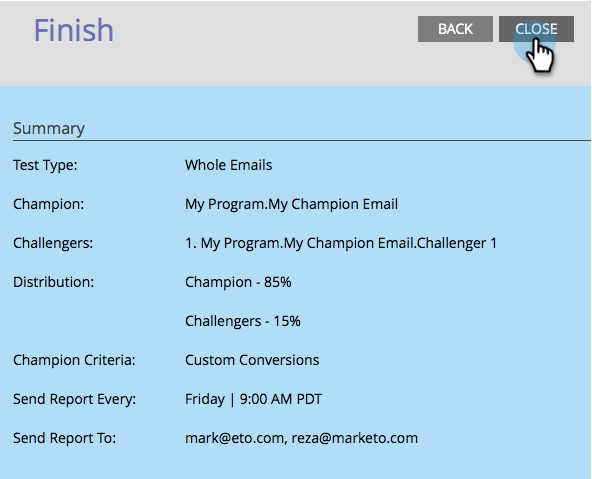

# Campione/Sfidante: analisi {#champion-challenger-analytics}

Ricevi avvisi sui rapporti e/o controlla la dashboard di Champion/Challenger per informazioni utili sulle analisi.

>[!PREREQUISITES]
>
>[Campione/Sfidante: definizione dei criteri campione](/help/marketo/product-docs/email-marketing/general/functions-in-the-editor/email-tests-champion-challenger/champion-challenger-define-champion-criteria.md)

## Configurare gli avvisi di rapporto {#configure-report-alerts}

Marketo ti invierà rapporti sull’andamento del test e-mail. Ecco come programmarlo.

1. Pianifichiamo l’invio del rapporto una volta alla settimana, venerdì alle 9.

   

   >[!TIP]
   >
   >Se lo desideri, puoi selezionare più giorni della settimana. Fai clic su per selezionare, fai di nuovo clic su per deselezionare.

1. Immetti gli indirizzi e-mail a cui desideri inviare i rapporti.

   

1. Fai clic su **Avanti**.

   

1. Verificare che tutte le informazioni siano corrette e fare clic su **Chiudi**.

   

   Il rapporto includerà dettagli quali: tipo di test, criteri dei vincitori, numero di aperture delle e-mail e altro ancora. Ci sarà anche un collegamento diretto al test stesso, che ti consentirà di dichiarare il vincitore! Roba fantastica.

## Dashboard Champion/Challenger {#champion-challenger-dashboard}

La dashboard di Champion/Challenger fornisce analisi dettagliate sulle prestazioni del controllo e delle varianti nella sperimentazione di Champion/Challenger (aperture, clic, percentuale di annullamento dell’abbonamento e altre variabili utilizzate durante la configurazione del test e-mail). La dashboard fornisce anche dettagli di distribuzione relativi al pubblico target per varie varianti di e-mail, nonché proporzioni aggregate per aperture, clic, rapporto clic/apertura e annullamenti dell’abbonamento per tutte le varianti.

