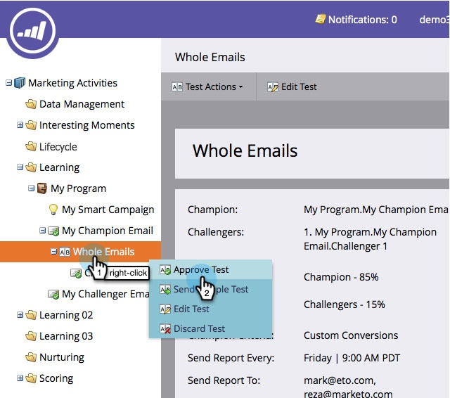

# Campione/Challenger: Approva Il Test E-Mail {#champion-challenger-approve-your-email-test}

Passaggio finale della configurazione del test e-mail per l’approvazione. Ecco come.

>[!PREREQUISITES]
>
>[Configura avvisi report](/help/marketo/product-docs/email-marketing/general/functions-in-the-editor/email-tests-champion-challenger/champion-challenger-analytics.md#configure-report-alerts)

1. Vai a **Attività di marketing**.

   

1. Trova e fai clic con il pulsante destro del mouse su **Prova e-mail**, quindi fai clic su **Approva test**.

   

   >[!NOTE]
   >
   >Quando si approva un test di **E-mail intera**, approvare prima l&#39;e-mail della sfida.

   >[!NOTE]
   >
   >Per inviare il test, scegli l&#39;e-mail a cui hai aggiunto il test nel passaggio di flusso **Invia e-mail** della campagna trigger. Puoi anche inserire l’e-mail nel flusso di un programma di coinvolgimento. Le e-mail Campione/Sfida non funzioneranno nelle campagne batch.

   Non è stato facile? Una volta ricevute alcune segnalazioni, vorrai dichiarare un campione.

   >[!MORELIKETHIS]
   >
   >* [Campione/Sfidante: dichiarare un campione](/help/marketo/product-docs/email-marketing/general/functions-in-the-editor/email-tests-champion-challenger/champion-challenger-declare-a-champion.md)
   >* [Campione/Sfidante: ignora un test e-mail](/help/marketo/product-docs/email-marketing/general/functions-in-the-editor/email-tests-champion-challenger/champion-challenger-discard-an-email-test.md)
