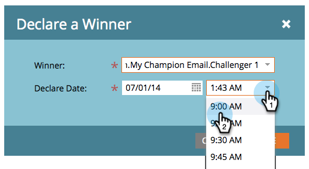

# Campione/Sfida: Dichiara un Campione {#champion-challenger-declare-a-champion}

Quando sei pronto, puoi dichiarare un campione per il test e-mail.

>[!MORELIKETHIS]
>
>[Campione/Challenger: Approva Il Test E-Mail](/help/marketo/product-docs/email-marketing/general/functions-in-the-editor/email-tests-champion-challenger/champion-challenger-approve-your-email-test.md)

1. Vai a **Attività di marketing**.

   

1. Trova e fai clic con il pulsante destro del mouse sul test e-mail, quindi fai clic su **Dichiara campione**.

   

1. Seleziona la **Vincitore** di tua scelta.

   

1. Imposta il **Dichiara data**.

   >[!NOTE]
   >
   >Fino al **Dichiara data**, Marketo continuerà a inviare i vecchi campioni e sfidanti. Una volta raggiunta la data/ora, verrà inviato solo il nuovo campione.

   

   >[!CAUTION]
   >
   >Si noti che il valore predefinito **Dichiara data** è domani, non oggi.

1. Seleziona un orario e fai clic su **Salva**.

   

   Rad! Ora sai come eseguire facilmente un test e-mail per migliorare il contenuto senza interruzioni della campagna.
