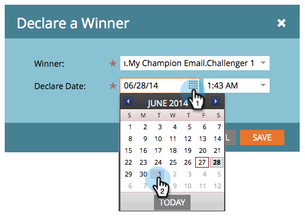

# Campione/Sfidante: dichiarare un campione {#champion-challenger-declare-a-champion}

Quando sei pronto, puoi dichiarare un campione per il test e-mail.

>[!MORELIKETHIS]
>
>[Campione/Sfidante: Approva Il Test E-Mail](/help/marketo/product-docs/email-marketing/general/functions-in-the-editor/email-tests-champion-challenger/champion-challenger-approve-your-email-test.md)

1. Passa a **[!UICONTROL Marketing Activities]**.

   

1. Trovare e fare clic con il pulsante destro del mouse sul test e-mail, quindi scegliere **[!UICONTROL Declare Champion]**.

   

1. Seleziona **[!UICONTROL Winner]** a tua scelta.

   

1. Imposta **[!UICONTROL Declare Date]**.

   >[!NOTE]
   >
   >Fino al **[!UICONTROL Declare Date]**, Marketo continuerà a inviare i vecchi campioni e sfidanti. Una volta raggiunta la data/ora, verrà inviato solo il nuovo campione.

   

   >[!CAUTION]
   >
   >Il **[!UICONTROL Declare Date]** predefinito è domani, non oggi.

1. Selezionare un&#39;ora e fare clic su **[!UICONTROL Save]**.

   

   Rad! Ora sai come eseguire facilmente un test e-mail per migliorare il contenuto senza interruzioni della campagna.
