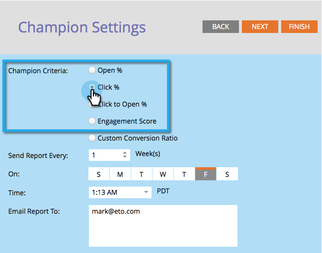

# Campione/sfida: Definisci criteri campione {#champion-challenger-define-champion-criteria}

Una volta impostato il tipo di test, è necessario definire i criteri campione. Ecco come.

>[!PREREQUISITES]
>
>[Aggiungi un campione e-mail/Challenger](/help/marketo/product-docs/email-marketing/general/functions-in-the-editor/email-tests-champion-challenger/add-an-email-champion-challenger.md)

## Criteri campione standard {#standard-champion-criteria}

1. Selezionare una delle opzioni disponibili **Criteri per i campioni**.

   

   >[!NOTE]
   >
   >Tratteremo questa metrica e ti invieremo un rapporto con i dati per e-mail.

1. Se hai scelto una delle opzioni predefinite **Criteri per i campioni**, vai avanti e passa a [Campione/sfida: Configurare gli avvisi dei rapporti](/help/marketo/product-docs/email-marketing/general/functions-in-the-editor/email-tests-champion-challenger/champion-challenger-configure-report-alerts.md)!

## Criteri campione personalizzati {#custom-champion-criteria}

1. Se vuoi ottenere fantasia, puoi andare personalizzato selezionando **Conversione personalizzata** e facendo clic su **Modifica**.

   

   >[!NOTE]
   >
   >Questo consente di impostare qualsiasi evento come conversione utilizzando attivatori e filtri.

1. Viene visualizzata una finestra - trova il trigger desiderato e trascinalo nell’area di lavoro.

   

1. Definisci il trigger.

   

   Marketo consente solo i trigger per le persone a cui è stato inviato il messaggio e-mail da questo programma e-mail. Non è necessario aggiungere un filtro &quot;È stato inviato un messaggio e-mail&quot;.

1. Fai clic su **Chiudi**.

   

   Fantastico! Ora è il momento di pianificare il rapporto.

   >[!MORELIKETHIS]
   >
   >[Campione/sfida: Configurare gli avvisi dei rapporti](/help/marketo/product-docs/email-marketing/general/functions-in-the-editor/email-tests-champion-challenger/champion-challenger-configure-report-alerts.md)
