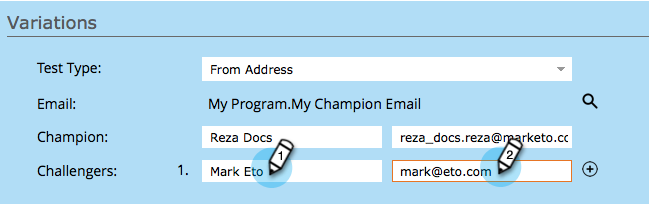

# Campione/sfida: Indirizzo mittente {#champion-challenger-from-address}

Vuoi provare un diverso Da Indirizzo senza confusione? Ecco come.

>[!PREREQUISITES]
>
>[Aggiungi un campione e-mail/Challenger](/help/marketo/product-docs/email-marketing/general/functions-in-the-editor/email-tests-champion-challenger/add-an-email-champion-challenger.md)

1. Nell’editor di test e-mail, seleziona **Indirizzo mittente** in **Tipo di test** a discesa.

   

   >[!NOTE]
   >
   >Il primo indirizzo Da è designato come **Campione**. Vengono chiamati gli indirizzi successivi **Sfide**.

1. Inserisci il **Nome da** (a sinistra) e **Indirizzo mittente** (a destra) per i sfidanti.

   

   >[!TIP]
   >
   >Se desideri più sfidanti, fai clic sul segno più e immetti un altro nome e un&#39;e-mail.

1. Trascina il cursore per decidere la percentuale di suddivisione tra le persone che ricevono le e-mail con il campione da indirizzo e coloro che ricevono le e-mail con lo sfidante da indirizzi.

   

   >[!NOTE]
   >
   >**Esempio**
   >
   >Nella distribuzione mostrata sopra, il 15% del pubblico totale specificato nella lista intelligente riceve una delle e-mail con un sfidante Da Indirizzo e l&#39;85% riceve l&#39;e-mail con il campione Da Indirizzo. Le e-mail per più sfidanti Da indirizzi condividono equamente il 15%. Al termine del test, puoi dichiarare manualmente un vincitore. Da quel momento in poi, tutti i futuri utenti riceveranno i contenuti con prestazioni migliori.

   Per ottenere l’affidabilità statistica, è necessario scegliere una percentuale che includa un numero sufficiente di persone per la validità del test. Non fatevi ingannare da risultati inconcludenti. [Più informazioni di quanto si volesse mai sulla fiducia statistica](https://en.wikipedia.org/wiki/Confidence_interval).

1. Fai clic su **Successivo**.

   

   Avanzamento! Continuiamo.

   >[!MORELIKETHIS]
   >
   >[Campione/sfida: Definisci criteri campione](/help/marketo/product-docs/email-marketing/general/functions-in-the-editor/email-tests-champion-challenger/champion-challenger-define-champion-criteria.md)
