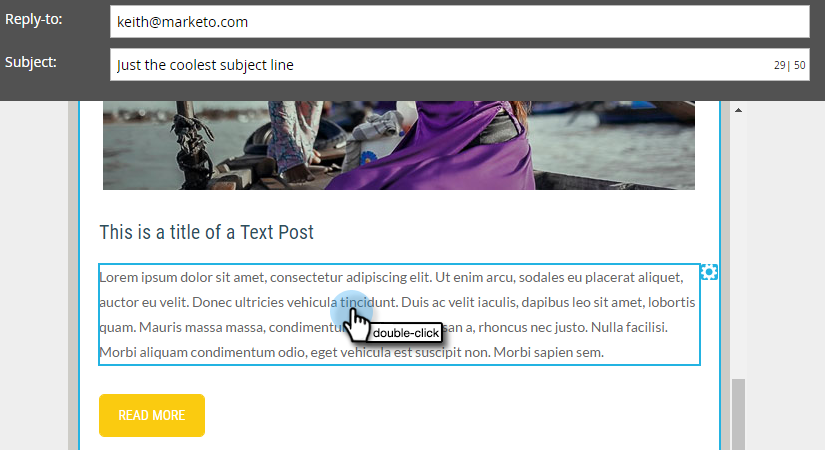
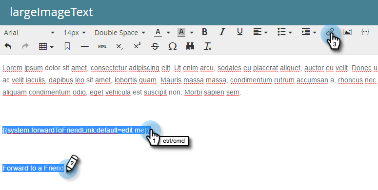

# Inoltra a un collegamento amico in e-mail {#forward-to-a-friend-link-in-emails}

L’aggiunta del collegamento &quot;Inoltra all’amico&quot; alle e-mail ti consente di tenere traccia delle persone che hanno ricevuto un’e-mail inoltrata tramite questo collegamento e di aggiungerle automaticamente come nuova persona, se non sono già presenti nel database.

Ad esempio, supponiamo che Keith utilizzi il collegamento &quot;Inoltra all’amico&quot; per inoltrare l’e-mail a una persona sconosciuta, Mark. Mark viene aggiunto automaticamente come persona nuova, gli viene assegnato il proprio cookie e una qualsiasi delle sue attività e-mail e web è collegata a lui. Tuttavia, se Keith utilizza il pulsante di inoltro nel suo client e-mail, Mark viene ricreato in modo non corretto come Keith e la sua attività viene registrata come Keith.

## Aggiungere il collegamento a un modello e-mail {#add-the-link-to-an-email-template}

1. Vai a **Design Studio**.

   

1. Trova e seleziona il modello e-mail a cui desideri aggiungere il collegamento. Fai clic su **Modifica bozza**.

   

1. Incolla il seguente codice HTML in cui vuoi visualizzare il collegamento &quot;Inoltra ad amico&quot; (se hai bisogno di aiuto con questa parte, rivolgiti al tuo sviluppatore web):

   `<pre data-theme="Confluence"><a href="{{system.forwardToFriendLink}}">Forward to Friend</a></pre>`

   

   >[!TIP]
   >
   >
   >Puoi aggiungere dello stile al collegamento per renderlo più gradevole. Ad esempio:
   >
   >`<a href="{{system.forwardToFriendLink}}" style="font-family:arial, sans-serif; padding:10px; position:absolute; right:0px;">Forward to Friend</a>`

   >[!CAUTION]
   >
   >Si sconsiglia di utilizzare lo stile **posizione:relativa** nel modello e-mail. Può creare problemi con la posizione e la visualizzazione della casella &quot;Inoltra all&#39;amico&quot;.

1. Fai clic su **Anteprima bozza** per assicurarti che il modello abbia l’aspetto desiderato.

   

   >[!NOTE]
   >
   >Ricordarsi di approvare la bozza del modello per applicare le modifiche.

   Ora tutte le e-mail che utilizzano quel modello avranno il link &quot;Inoltra all’amico&quot;. Quando il destinatario dell’e-mail fa clic su di esso, verrà portato a una versione web dell’e-mail con la casella &quot;Inoltra a un amico&quot;:

   

## Aggiungi il collegamento a un’e-mail singola {#add-the-link-to-an-individual-email}

Puoi anche aggiungere il link &quot;Inoltra all&#39;amico&quot; direttamente in un&#39;e-mail.

1. Apri l’e-mail in cui desideri includere il collegamento e fai doppio clic nell’area modificabile.

   

1. Posiziona il cursore nel punto in cui vuoi visualizzare il collegamento e fai clic sul pulsante **Inserisci token** pulsante .

   

1. Seleziona la **`{{system.forwardToFriendLink}}`** token.

   

   >[!NOTE]
   >
   >Questo token è l’URL della versione web dell’e-mail con una casella &quot;Inoltra all’amico&quot;.

1. Indicare il testo da visualizzare del collegamento (ad esempio, &quot;Inoltra a un amico&quot;).

   

1. Taglia **`{{system.forwardToFriendLink}}`** token utilizzando Ctrl+X (Windows) o Comando+X (Mac). Evidenzia &quot;Inoltra a un amico&quot; e fai clic sul pulsante **Inserisci/Modifica collegamento** pulsante .

   

1. Incolla **`{{system.forwardToFriendLink}}`** token in **URL** con Ctrl/Comando+V, quindi fai clic su **Inserisci**.

   

1. Salva la modifica e visualizza in anteprima il nuovo collegamento.

   

   >[!NOTE]
   >
   >Le nuove persone che vengono aggiunte ricevendo un’e-mail &quot;Inoltra a un amico&quot; vengono per impostazione predefinita annullate l’iscrizione alle e-mail di marketing.

## Visualizza attività di inoltro {#view-forwarding-activity}

Puoi vedere chi ha inoltrato e ricevuto le e-mail nel registro attività della persona.

1. Vai a **`Database`**.

   

1. Fai doppio clic sulla persona per la quale desideri visualizzare l’attività.

   

1. Vai a **Registro attività** scheda . Fare doppio clic **Inoltra a Amico e-mail ricevuto** o **Inviato a Amico e-mail** per visualizzare i dettagli.

   

   >[!NOTE]
   >
   >**Definizione**
   >
   >Per e-mail inoltrata all’amico, l’ID persona è la persona che ha inoltrato l’e-mail.
   >
   >Per Inoltra a e-mail amico, l’ID persona è la persona che ha ricevuto l’e-mail.

   

1. Per visualizzare una persona per ID, copia e incolla **ID persona** alla fine dell’URL (l’inizio di tale URL dipende dall’istanza Marketo):

   `<pre data-theme="Confluence">...marketo.com/Database/loadPersonDetail?personId=</pre>`

   >[!NOTE]
   >
   >Faremo **ID persona** fai clic su e collega direttamente alla persona in una patch imminente.

   

   >[!NOTE]
   >
   >Se l’amico che riceve l’inoltro è una persona sconosciuta, viene creata una nuova persona con &quot;Inoltra all’amico&quot; contrassegnata come **Origine**.
   >Se l’e-mail è una risorsa locale di un programma, il programma viene contrassegnato come **Programma di acquisizione**.

## Trigger o filtro con attività di inoltro {#trigger-or-filter-using-forwarding-activity}

Sono disponibili sei trigger/filtri che puoi utilizzare per attivare azioni di flusso o filtrare le persone inviando e ricevendo l’attività &quot;Inoltra all’amico&quot;.

Nell’elenco smart di una campagna intelligente, se cerchi &quot;avanti&quot; troverai i trigger e i filtri disponibili.

## Test inoltrato all&#39;amico {#test-forward-to-friend}

Per testare &quot;Inoltra all&#39;amico&quot;, invia un&#39;e-mail con il link in avanti. Assicurati di inviarlo attraverso il **Invia e-mail** gradino di flusso, *not* attraverso **Invia e-mail di test**.
