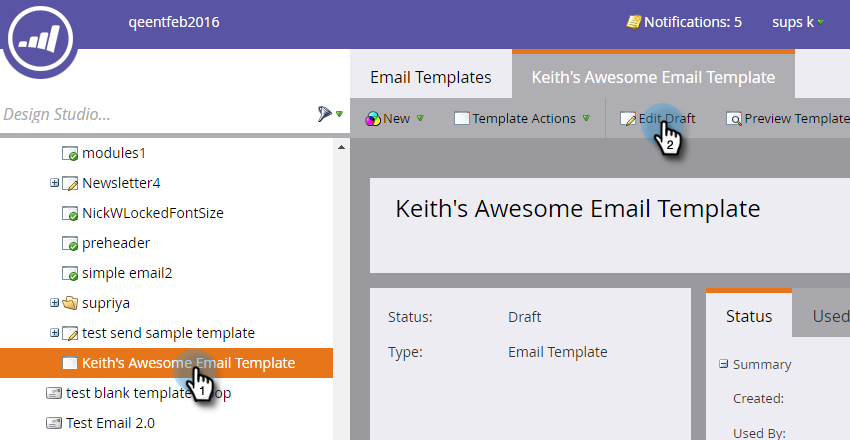

# Inoltra a un collegamento amico nelle e-mail {#forward-to-a-friend-link-in-emails}

L&#39;aggiunta del collegamento &quot;Inoltra a amico&quot; alle e-mail consente di tenere traccia delle persone che hanno ricevuto un&#39;e-mail inoltrata tramite questo collegamento e di aggiungerle automaticamente come nuova persona, se non sono già presenti nel database.

Ad esempio, Keith utilizza il collegamento &quot;Inoltra all’amico&quot; per inoltrare l’e-mail a una persona sconosciuta, Mark. Mark viene aggiunto automaticamente come persona nuova, viene assegnato il proprio cookie e una qualsiasi delle sue attività e-mail e web è collegata a lui. Tuttavia, se Keith utilizza il pulsante di inoltro nel client di posta elettronica, Mark riceve un cookie non corretto come Keith e la sua attività viene registrata come Keith.

>[!NOTE]
>
>**FYI**
>
>Marketo sta standardizzando la lingua tra tutte le iscrizioni, pertanto è possibile che nell&#39;abbonamento siano presenti lead/lead e persone in docs.marketo.com. Questi termini significano la stessa cosa; non influisce sulle istruzioni dell&#39;articolo. Ci sono anche altri cambiamenti. [Ulteriori](http://docs.marketo.com/display/DOCS/Updates+to+Marketo+Terminology)informazioni.

## Aggiungere il collegamento a un modello e-mail {#add-the-link-to-an-email-template}

1. Andate a **Design Studio**.

   

1. Individuate e selezionate il modello e-mail a cui desiderate aggiungere il collegamento. Fate clic su **Modifica bozza**.

   

1. Incollate il seguente codice HTML in cui desiderate visualizzare il collegamento &quot;Inoltra a amico&quot; (se avete bisogno di aiuto con questa parte, conferitelo allo sviluppatore Web):

   `<pre data-theme="Confluence"><a href="{{system.forwardToFriendLink}}">Forward to Friend</a></pre>`

   

   >[!TIP]
   >
   >
   >Puoi aggiungere lo stile al collegamento per renderlo più piacevole. Ad esempio:
   >
   >`<a href="{{system.forwardToFriendLink}}" style="font-family:arial, sans-serif; padding:10px; position:absolute; right:0px;">Forward to Friend</a>`

   >[!CAUTION]
   >
   >Non è consigliabile utilizzare lo stile **position:relative** nel modello e-mail. Può creare problemi con la posizione e la visualizzazione della casella &quot;Inoltra all&#39;amico&quot;.

1. Fate clic su **Anteprima bozza** per assicurarvi che il modello abbia l&#39;aspetto desiderato.

   

   >[!NOTE]
   >
   >**Promemoria**
   >
   >Ricordate di approvare la bozza del modello per applicare le modifiche.

   Ora tutte le e-mail che utilizzano tale modello avranno il collegamento &quot;Inoltra all&#39;amico&quot;. Quando il destinatario dell&#39;e-mail fa clic su di esso, verrà indirizzato a una versione Web dell&#39;e-mail con la casella &quot;Inoltra a un amico&quot;:
   

## Aggiungere il collegamento a un&#39;e-mail singola {#add-the-link-to-an-individual-email}

Puoi anche aggiungere il collegamento &quot;Inoltra a amico&quot; direttamente in un&#39;e-mail.

1. Aprite il messaggio e-mail in cui desiderate includere il collegamento e fate doppio clic nell’area modificabile.

   

1. Posizionare il cursore nel punto in cui si desidera visualizzare il collegamento e fare clic sul pulsante **Inserisci token** .

   

1. Selezionate il **`{{system.forwardToFriendLink}}`** token.

   

   >[!NOTE]
   >
   >Questo token è l’URL della versione Web dell’e-mail con la casella &quot;Inoltra all’amico&quot;.

1. Indicare il testo da visualizzare del collegamento (ad esempio, &quot;Inoltra a un amico&quot;).

   

1. Tagliate il **`{{system.forwardToFriendLink}}`** token utilizzando Ctrl+X (Windows) o Cmd+X (Mac). Evidenzia &quot;Inoltra a un amico&quot; e fai clic sul pulsante **Inserisci/Modifica collegamento** .

   

1. Incollate il **`{{system.forwardToFriendLink}}`** token nella casella **URL** utilizzando Ctrl/Comando+V, quindi fate clic su** Inserisci*.

   

1. Salva la modifica e visualizza in anteprima il nuovo collegamento!

   

   >[!NOTE]
   >
   >Per impostazione predefinita, le nuove persone che vengono aggiunte ricevendo un messaggio e-mail di tipo &quot;Inoltra a un amico&quot; vengono annullate dalla sottoscrizione alle e-mail di marketing.

## Visualizza attività di inoltro {#view-forwarding-activity}

Puoi vedere chi ha inoltrato e ricevuto le e-mail nel log delle attività della persona.

1. Vai al **`Database`**.

   

1. Fate doppio clic sulla persona per la quale desiderate visualizzare l&#39;attività.

   

1. Passate alla scheda Registro **** attività. Fate doppio clic su **Ricevuto inoltrato a Amica e-mail** o **Inviato a Amica e-mail** per visualizzare i dettagli.

   

   >[!NOTE]
   >
   >**Definizione**
   >
   >
   >Per E-mail ricevuta da un amico, l’ID persona è la persona che ha inoltrato l’e-mail.
   >
   >
   >Per Invia a e-mail amico, l’ID persona è la persona che ha ricevuto l’e-mail.

   

1. Per visualizzare una persona per ID, copiate e incollate l&#39;** ID persona** alla fine dell&#39;URL (l&#39;inizio di tale URL dipende dall&#39;istanza di Marketo):

   `<pre data-theme="Confluence">...marketo.com/Database/loadPersonDetail?personId=</pre>`

   >[!NOTE]
   >
   >Faremo clic sull’ID **** persona e collegheremo direttamente alla persona in una patch imminente.

   

   >[!NOTE]
   >
   >Se l&#39;amico che riceve il avanti è una persona sconosciuta, viene creata una nuova persona con &quot;Inoltra all&#39;amico&quot; contrassegnato come **Origine** della persona.\
   >Se l’e-mail è una risorsa locale di un programma, il programma viene contrassegnato come programma **di** acquisizione della persona.

## Attivazione o filtro tramite l&#39;attività di inoltro {#trigger-or-filter-using-forwarding-activity}

Esistono sei attivatori/filtri che puoi usare per attivare azioni di flusso o filtrare le persone mediante l’attività &quot;Inoltra all’amico&quot; inviata e ricevuta.

Nell&#39;elenco smart della campagna, se cercate &quot;avanti&quot;, troverete le attivazioni e i filtri disponibili.

## Test inoltrato all&#39;amico {#test-forward-to-friend}

Per testare ‘Inoltra all’amico’, inviatevi un’e-mail con il collegamento in avanti. Accertatevi di inviarlo tramite il passaggio **Invia flusso e-mail** , *non* tramite **Invia e-mail** di prova.
