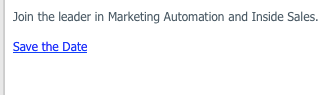

# Includere un evento calendario (.ics) in un’e-mail {#include-a-calendar-event-ics-in-an-email}

Un token File calendario consente di aggiungere un collegamento di evento calendario (con estensione ics) alle e-mail di Marketo.

>[!PREREQUISITES]
>
>[Crea un file evento calendario (.ics)](/help/marketo/product-docs/email-marketing/general/functions-in-the-editor/create-a-calendar-event-ics-file.md)

1. Durante la modifica dell&#39;e-mail del programma, fai clic nel punto in cui desideri spostare il token, quindi fai clic sul pulsante **Inserisci token**.

1. Selezionare il token del file di calendario e fare clic su **[!UICONTROL Insert]**.

   

1. Fai clic su **[!UICONTROL Save]**.

   

   I destinatari riceveranno un’e-mail con questo aspetto.

   

Missione compiuta!
