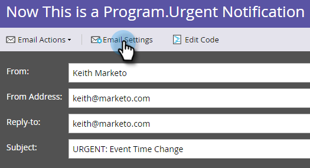

# Rendere operativa un’e-mail {#make-an-email-operational}

Le e-mail operative ignorano gli stati Annulla sottoscrizione e Sospendi marketing . Inviano qualunque cosa.

>[!NOTE]
>
>Le e-mail operative non sono soggette a limiti di comunicazione.

1. Trova il tuo messaggio e-mail, selezionalo e fai clic su **Modifica bozza**.

>[!NOTE]
>
>Utilizza solo le e-mail operative per le e-mail critiche e per le risposte automatiche. Non sono destinati alle e-mail di marketing.

1. Una volta aperto l’editor, fai clic su **Impostazioni e-mail**.

   

1. Controlla **E-mail operativa** e fai clic su **Salva**.

   

>[!CAUTION]
>
>Le e-mail operative non sono state progettate per funzionare con i programmi di coinvolgimento. Pertanto, un programma di coinvolgimento ignorerà lo stato operativo di un’e-mail. Tenetelo presente quando lavorate con loro.

Non dimenticare di approvare questo messaggio e-mail per rendere effettive le modifiche. Scopri come  [approvare un messaggio e-mail](/help/marketo/product-docs/email-marketing/general/creating-an-email/approve-an-email.md).
