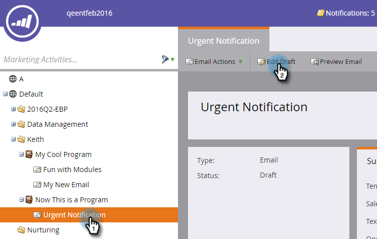

# Rendere operativa un’e-mail {#make-an-email-operational}

Le e-mail operative ignorano gli stati Annullamento iscrizione e Marketing sospeso. Inoltre, non sono soggetti a limiti di comunicazione. Non importa cosa mandano.

>[!NOTE]
>
>Le e-mail operative non vengono conteggiate per i limiti di comunicazione. Ad esempio, se un utente può ricevere una sola e-mail alla settimana e gli hai già inviato un’e-mail di marketing, puoi comunque inviargli un’e-mail operativa, se necessario.

1. Trova il tuo indirizzo e-mail, selezionalo e fai clic su **[!UICONTROL Edit Draft]**.

>[!NOTE]
>
>Utilizza solo e-mail operative per e-mail e risponditori automatici di importanza critica. Non sono destinati alle e-mail di marketing.

1. Una volta aperto l&#39;editor, fare clic su **[!UICONTROL Email Settings]**.

   

1. Selezionare **[!UICONTROL Operational Email]** e fare clic su **[!UICONTROL Save]**.

   

>[!CAUTION]
>
>Le e-mail operative non erano progettate per funzionare con i programmi di coinvolgimento. Pertanto, un programma di coinvolgimento ignorerà lo stato operativo di un’e-mail. Tienilo presente quando lavori con loro.

Per rendere effettive le modifiche, non dimenticare di approvare questa e-mail. Scopri come [approvare un&#39;e-mail](/help/marketo/product-docs/email-marketing/general/creating-an-email/approve-an-email.md).
