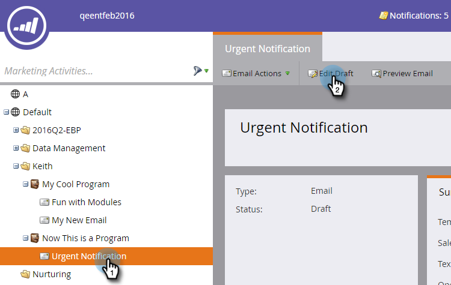

# Impostazione di un&#39;e-mail {#make-an-email-operational}

I messaggi e-mail operativi ignorano gli stati Non sottoscritti e Sospesa marketing. Mandano qualunque cosa.

>[!NOTE]
>
>Le e-mail operative non sono soggette a limiti di comunicazione.

1. Individuate il messaggio e-mail, selezionatelo e fate clic su Modifica bozza.

>[!NOTE]
>
>**Promemoria**
>
>È consigliabile utilizzare solo le e-mail operative per le e-mail critiche e per le risposte automatiche. Non sono destinati alle e-mail di marketing.

1. Una volta aperto l’editor, fate clic su Impostazioni **e-** mail.

   

1. Selezionate E-mail **** operativa e fate clic su **Salva**.

   

>[!CAUTION]
>
>Le e-mail operative non sono state progettate per funzionare con i programmi di coinvolgimento. Pertanto, un programma di coinvolgimento ignorerà lo stato operativo di un&#39;e-mail. Tenetelo presente quando lavorate con loro.

Non dimenticare di approvare questo messaggio e-mail per rendere effettive le modifiche. Scoprite come [approvare un messaggio e-mail](../../../../product-docs/email-marketing/general/creating-an-email/approve-an-email.md).