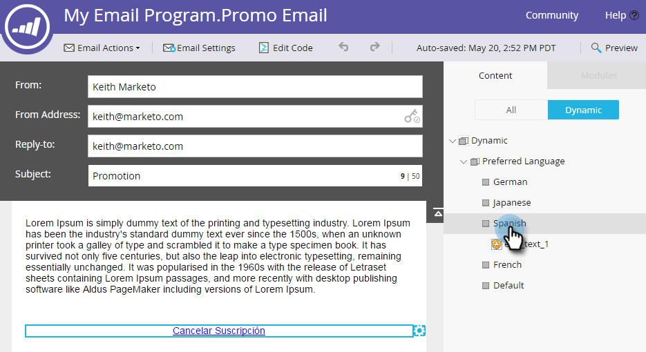

# Visualizzare in anteprima un&#39;e-mail con contenuto dinamico {#preview-an-email-with-dynamic-content}

Visualizzate l’anteprima del messaggio e-mail dopo l’aggiunta di contenuto dinamico per verificarlo.

1. Selezionate il messaggio e-mail e fate clic su **Anteprima e-mail**.

   

   Fate clic sul menu a discesa Visualizza per e selezionate il tipo di contenuto dinamico da visualizzare in anteprima.
   

1. Viene visualizzato un nuovo elenco a discesa. Fate clic su di esso e scegliete il contenuto specifico.

   

1. Usate le frecce per scorrere le opzioni.

   

Potete anche visualizzare l&#39;anteprima del contenuto dinamico direttamente nell&#39;editor e-mail.

1. In **Content**, fare clic sulla scheda **Dynamic**.

   

1. Fate clic sul contenuto da visualizzare in anteprima.

   

Fantastico! Visualizzate l&#39;anteprima delle e-mail per verificare che il contenuto sia quello desiderato.
