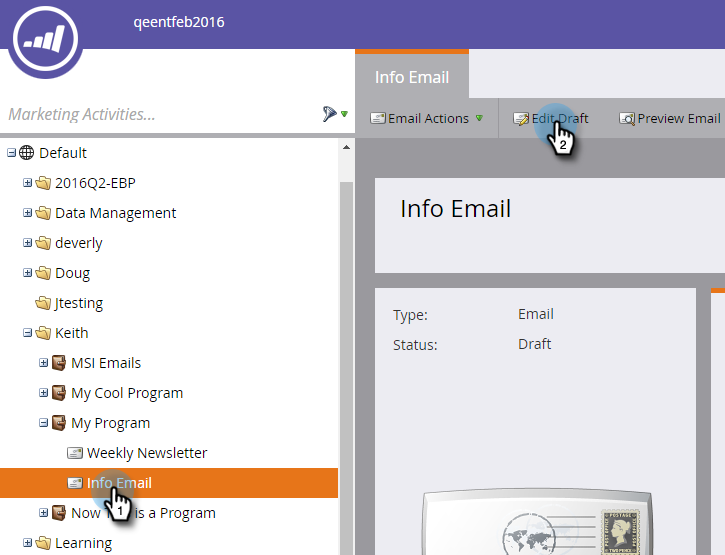

# Invia e-mail dal proprietario lead {#send-emails-from-the-lead-owner}

Cosa succede se desideri inviare un’e-mail a un lead per conto del proprietario lead?  Ecco come.

1. Trova il tuo messaggio e-mail, selezionalo e fai clic su **Modifica bozza**.

   

1. Fai clic in **Da** (eliminare un nome esistente), quindi fare clic sul pulsante **Inserisci token** pulsante .

   

1. Inizia a digitare &quot;`{{lead.Lead Owner`&quot; e seleziona la **`{{lead.Lead Owner First Name}}`** token.

   

1. Immetti un valore predefinito nel caso in cui il lead non disponga ancora di un proprietario di lead e fai clic su **Inserisci**.

   

1. Fai clic dopo il primo token, aggiungi uno spazio, quindi fai clic sul **Inserisci token** pulsante .

   

1. Inizia a digitare &quot;`{{lead.Lead Owner`&quot; e seleziona la **`{{lead.Lead Owner Last Name}}`** token.

   

1. Immetti un valore predefinito nel caso in cui il lead non disponga ancora di un proprietario di lead e fai clic su **Inserisci**.

   

   >[!TIP]
   >
   >Assicurati di aver aggiunto uno spazio tra i token del nome e del cognome.

1. Fai clic nel campo Da e-mail (elimina qualsiasi indirizzo e-mail esistente) e fai clic sul pulsante Inserisci token .

   

1. Inizia a digitare &quot;`{{lead.Lead Owner`&quot; e seleziona la **`{{lead.Lead Owner Email Address}}`** token.

   

1. Immetti un valore predefinito nel caso in cui il lead non disponga ancora di un proprietario di lead e fai clic su **Inserisci**.

   

1. Assicurati che **Risposta** e **Oggetto** i campi sono popolati e hai finito!

   
