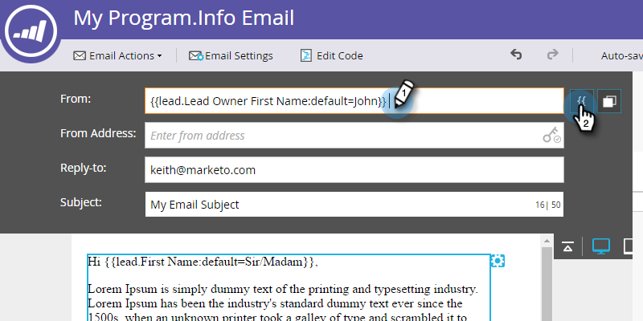
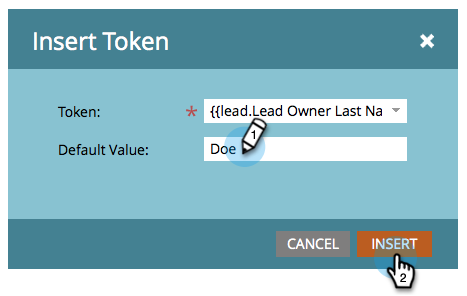
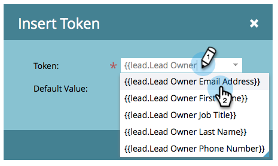

# Inviare e-mail dal proprietario del lead {#send-emails-from-the-lead-owner}

Cosa succede se desideri inviare un’e-mail a un lead per conto del proprietario del lead?  Ecco come.

1. Trova il tuo indirizzo e-mail, selezionalo e fai clic su **[!UICONTROL Edit Draft]**.

   

1. Fai clic nel campo **[!UICONTROL From]** (elimina eventuali nomi esistenti), quindi fai clic sul pulsante **Inserisci token**.

   

1. Inizia a digitare &quot;`{{lead.Lead Owner`&quot; e seleziona il token **`{{lead.Lead Owner First Name}}`**.

   

1. Immettere un valore predefinito nel caso in cui il lead non disponga ancora di un proprietario lead e fare clic su **[!UICONTROL Insert]**.

   

1. Fare clic dopo il primo token, aggiungere uno spazio, quindi fare clic sul pulsante **Inserisci token**.

   

1. Inizia a digitare &quot;`{{lead.Lead Owner`&quot; e seleziona il token **`{{lead.Lead Owner Last Name}}`**.

   

1. Immettere un valore predefinito nel caso in cui il lead non disponga ancora di un proprietario lead e fare clic su **[!UICONTROL Insert]**.

   

   >[!TIP]
   >
   >Assicurati di aver aggiunto uno spazio tra i token di nome e cognome.

1. Fai clic nel campo **[!UICONTROL From Address]** (elimina eventuali indirizzi e-mail esistenti), quindi fai clic sul pulsante **Inserisci token**.

   

1. Inizia a digitare &quot;`{{lead.Lead Owner`&quot; e seleziona il token **`{{lead.Lead Owner Email Address}}`**.

   

1. Immettere un valore predefinito nel caso in cui il lead non disponga ancora di un proprietario lead e fare clic su **[!UICONTROL Insert]**.

   

1. Completare i campi **[!UICONTROL Reply-to]** e **[!UICONTROL Subject]**.

   
