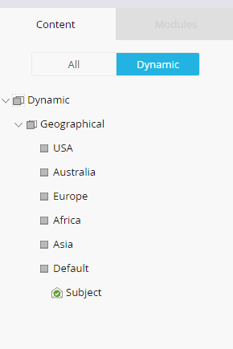

# Utilizzo di contenuti dinamici in un’e-mail {#using-dynamic-content-in-an-email}

>[!PREREQUISITES]
>
>[Creare una segmentazione](/help/marketo/product-docs/personalization/segmentation-and-snippets/segmentation/create-a-segmentation.md)

Utilizza il contenuto dinamico nelle e-mail per inviare ai lead informazioni mirate.

>[!NOTE]
>
>L’utilizzo di variabili all’interno del contenuto dinamico in un messaggio e-mail è supportato solo quando si utilizzano le campagne trigger. È **not** supportato quando si utilizzano campagne batch.

## Aggiungi segmentazione {#add-segmentation}

1. Vai a **Attività di marketing**.

   

1. Seleziona l’e-mail e fai clic su **Modifica bozza**.

   

1. In questo esempio stiamo rendendo dinamica la Linea oggetto. Fai clic nel campo Oggetto , quindi fai clic sul pulsante **Rendi dinamico** pulsante .

   

   >[!NOTE]
   >
   >Puoi anche creare un elemento all’interno dell’e-mail dinamica. A questo scopo, seleziona l’area, fai clic sull’icona a forma di ingranaggio e seleziona **Rendi dinamico** o [Sostituisci con frammento](/help/marketo/product-docs/personalization/segmentation-and-snippets/snippets/create-a-snippet.md), a seconda di quello che stai facendo).

1. Inserisci il nome Segmentazione, selezionalo e fai clic su **Salva**.

   

   La segmentazione e i relativi segmenti vengono visualizzati nella scheda Dinamico a destra.

   

## Applica contenuto dinamico {#apply-dynamic-content}

>[!CAUTION]
>
>Il numero di elementi di contenuto dinamico consentiti non è illimitato. Anche se non esiste un limite di numero specifico (che può variare in base alla combinazione di contenuto), l’utilizzo eccessivo del contenuto dinamico può influire negativamente sulle prestazioni dell’e-mail. È consigliabile mantenere la quantità di elementi di contenuto dinamico utilizzati per meno di 20 per e-mail.

1. Fai clic sui segmenti e aggiungi l’oggetto.

1. Ripeti per ogni segmento.

   

>[!TIP]
>
>Crea un’e-mail predefinita prima di applicare contenuti ai vari segmenti.

>[!CAUTION]
>
>Le modifiche al blocco di contenuto del segmento predefinito vengono applicate a tutti i segmenti.

Dolce! Ora puoi inviare e-mail flessibili al pubblico di destinazione.

>[!MORELIKETHIS]
>
>* [Visualizzare un’anteprima di un’e-mail con contenuto dinamico](/help/marketo/product-docs/email-marketing/general/functions-in-the-editor/preview-an-email-with-dynamic-content.md)
>* [Utilizzare i contenuti dinamici in una pagina di destinazione](/help/marketo/product-docs/demand-generation/landing-pages/free-form-landing-pages/use-dynamic-content-in-a-free-form-landing-page.md)

