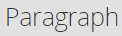

# Utilizzo dell’Editor Rich Text {#using-the-rich-text-editor}

L’editor Rich Text viene visualizzato in Marketo ed è disponibile ogni volta che desideri aggiungere o modificare contenuti. Ne vedrai una versione su pagine di destinazione, programmi, e-mail, moduli e snippet. Fai clic su **[!UICONTROL Edit Draft]** per visualizzarlo.

## Impostazioni editor {#editor-settings}

L’impostazione dell’elemento del blocco principale definisce i tag che racchiudono il contenuto. Per impostazione predefinita, l&#39;elemento blocco radice e-mail utilizza `
` tag. Puoi modificare questa impostazione seguendo la procedura descritta di seguito.

>[!TIP]
>
>Anche se puoi scegliere l’elemento del blocco principale, ti consigliamo sempre di utilizzare le impostazioni predefinite per una migliore esperienza utente.

1. Fai clic su **[!UICONTROL Admin]**.

   

1. Fai clic su **[!UICONTROL Email]**.

   

1. Fai clic su **[!UICONTROL Edit Text Editor Settings]**.

   

1. Nel menu a discesa **[!UICONTROL Email]/[!UICONTROL Snippet Editor]**, selezionare `
` o [!UICONTROL None] e fare clic su **[!UICONTROL Save]**. `
` è utilizzato in questo esempio.

   

   Se hai `

` in un Modello e-mail, visualizzerai il seguente comportamento di HTML Source quando apri la sezione e digiti &quot;Text Goes Here&quot; nell&#39;editor:

<table>
 <tbody>
  <tr>
   <th>&lt;p&gt;</th>
   <th>&lt;div&gt;</th>
   <th>Nessuna</th>
  </tr>
  <tr>
   <td>
&lt;div class="mktEditable"&gt; &lt;p&gt;Il testo va qui&lt;/p&gt; &lt;/div&gt;
</td>
   <td>
&lt;div class="mktEditable"&gt; &lt;div&gt;Il testo va qui&lt;/div&gt; &lt;/div&gt;
</td>
   <td>
&lt;div class="mktEditable"&gt; Testo da inserire &lt;/div&gt;
</td>
  </tr>
 </tbody>
</table>

>[!TIP]
>
>È inoltre possibile modificare l&#39;elemento del blocco principale dell&#39;Editor pagina di destinazione seguendo gli stessi passaggi, ma facendo clic sull&#39;elenco a discesa **[!UICONTROL Landing Page Editor]** nel passaggio 4 anziché su [!UICONTROL Email] / [!UICONTROL Snippet Editor].

>[!NOTE]
>
>L&#39;elemento del blocco radice è sempre `
` per i token del programma Rich Text.

## Funzioni {#features}

Di seguito sono elencate le funzioni disponibili in un editor Rich Text.

| Icona | Nome | Funzionamento |
|---|---|---|
|  | [!UICONTROL Font Family] | Scegli il tuo stile. Ce n&#39;è un sacco! |
|  | [!UICONTROL Font Size] | Quanto la volete grande? 25 opzioni, da 8 a 90 px. |
|  | [!UICONTROL Styles] | Scegliere Paragrafo o sei stili Titolo (per le pagine di destinazione). |
|  | [!UICONTROL Line Spacing] | Scegliete la distanza tra le linee. |
|  | [!UICONTROL Text Color] | Nero, rosso o qualsiasi altra cosa tu voglia. |
|  | [!UICONTROL Background Color] | Evidenzia per enfasi. |
|  | [!UICONTROL Bold] | **Più scuro e più spesso**. |
|  | [!UICONTROL Italic] | *Angolato, per enfasi o offerta*. |
|  | [!UICONTROL Underline] | Inserisce una riga sotto il testo. |
|  | [!UICONTROL Alignment] | Utilizza questo menu a discesa per disporre il testo e le immagini. Centrali, scegliete l&#39;allineamento a sinistra o a destra oppure distribuite il bordo allo spigolo con una giustificazione completa. |  |  | Elenco | Scegli punti elenco o numeri dal menu a discesa. Gli elenchi puntati sono utili per elenchi e numeri con passaggi. |
|  | [!UICONTROL Indent] | Scegli un rientro maggiore o minore. Utilizzare per i paragrafi o per qualsiasi testo che si desidera evidenziare. |
|  | [!UICONTROL Insert/Edit Link] | Inserisci un collegamento a un sito web o a un altro contenuto; apporta facilmente modifiche. |
|  | [!UICONTROL Insert/Edit Image] | Un&#39;immagine vale mille parole. Rilasciane uno. Fare clic sull&#39;icona della fotocamera per sfogliare Design Studio. È possibile inserire le immagini una accanto all&#39;altra. |
|  | [!UICONTROL Insert Token] | Uno strumento potente, ottimo per la personalizzazione e-mail e il tracciamento dei dati. Assicurati di immettere un valore predefinito. |
|  | [!UICONTROL Undo] | Ops! Torniamo indietro di un passo e riproviamo. |
|  | [!UICONTROL Redo] | Se va davvero bene così com&#39;è, torna all&#39;originale. |
|  | [!UICONTROL Table] | Costruisci il tuo, come questo. Un menu a discesa consente di configurarlo. |
|  | [!UICONTROL Insert Anchor] | Rilascia l&#39;ancora! |
|  | [!UICONTROL Horizontal Line] | Molti utilizzi: ottimo per la divisione delle sezioni. |
|  | [!UICONTROL Edit HTML] | Attiva HTML Source Editor per modificare il codice. |
|  | [!UICONTROL Subscript] | Lettere poco sporgenti (come in O`2`). |
|  | [!UICONTROL Superscript] | Hai il potere! (2`6`). |
|  | [!UICONTROL Strikethrough] | `<s>Put a line through text, like this</s>`. |
|  | [!UICONTROL Special Character] | Vuoi parlare di euro? Matematica? Hai 243 scelte. |
|  | [!UICONTROL Find and Replace] | Cerca e modifica le cose molto più rapidamente rispetto alla ricerca di ogni istanza. |
|  | [!UICONTROL Clear Formatting] | Ripristina gli standard. |
|  | [!UICONTROL Cancel] | Premi il pulsante per dire, &quot;Non importa&quot;. |
|  | [!UICONTROL Save] | Premete il pulsante per dire &quot;OK, mi piace&quot;. |

>[!TIP]
>
>Puoi modificare il HTML e il testo su schermate separate. Assicurarsi di fare clic su **[!UICONTROL Copy from HTML]** nella scheda **[!UICONTROL Text]** e quindi su **[!UICONTROL Save]** in modo che il testo corrisponda al HTML.

>[!NOTE]
>
>Non sei limitato ai font presenti nel menu a discesa. Per utilizzarne uno non elencato, accedi al codice HTML. Tutti i tipi di carattere Web sono supportati in Marketo, ma i tipi di carattere Web non funzionano in modo universale in tutti i client di posta elettronica.

## Pagine di destinazione {#landing-pages}

L’impostazione dell’elemento del blocco principale definisce i tag che racchiudono il contenuto. Per impostazione predefinita, l&#39;elemento del blocco principale della pagina di destinazione utilizza `
` tag. Per modificare questa impostazione, segui la procedura riportata di seguito.

>[!TIP]
>
>Anche se puoi scegliere l’elemento del blocco principale, ti consigliamo sempre di utilizzare le impostazioni predefinite per una migliore esperienza utente.

1. Fai clic su **[!UICONTROL Admin]**.

   

1. Fai clic su **[!UICONTROL Email]**.

   

1. Fai clic su **[!UICONTROL Edit Text Editor Settings]**.

   

1. Nel menu a discesa **[!UICONTROL Landing Page Editor]**, selezionare `
` o [!UICONTROL None] e fare clic su **[!UICONTROL Save]**. `
` è utilizzato in questo esempio.

   

   Ed è tutto!
