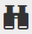

# Utilizzo dell’editor Rich Text {#using-the-rich-text-editor}

L’Editor Rich Text viene visualizzato in Marketo ed è disponibile ogni volta che desideri aggiungere o modificare contenuti. Ne vedrai una versione su pagine di destinazione, programmi, e-mail, moduli e snippet. Fai clic su **Modifica bozza** E salterà fuori per servirti.

## Impostazioni editor {#editor-settings}

L’impostazione dell’elemento del blocco principale definisce quali tag racchiudono il contenuto. Per impostazione predefinita, l’elemento del blocco principale e-mail utilizza `
` tag. Puoi modificare questa impostazione seguendo i passaggi seguenti.

>[!TIP]
>
>Sebbene sia possibile scegliere l’elemento del blocco principale, si consiglia sempre di utilizzare le impostazioni predefinite per la migliore esperienza utente.

1. Fai clic su **Amministratore**.

   

1. Fai clic su **E-mail**.

   

1. Fai clic su **Modifica impostazioni editor di testo**.

   

1. In **Editor e-mail/snippet** a discesa, seleziona `
` o Nessuno e fai clic su **Salva**. `
` viene utilizzato in questo esempio.

   

   Se `

` in un modello e-mail, visualizzerai il seguente comportamento Origine HTML quando apri la sezione e digita &quot;Testo torna qui&quot; nell’editor:

<table> 
 <tbody> 
  <tr> 
   <th>&lt;p&gt;</th> 
   <th>&lt;div&gt;</th> 
   <th>Nessuna</th> 
  </tr> 
  <tr> 
   <td>
&lt;div class="“mktEditable”"&gt; &lt;p&gt;Testo visualizzato qui&lt;/p&gt; &lt;/div&gt;
</td> 
   <td>
&lt;div class="“mktEditable”"&gt; &lt;div&gt;Testo visualizzato qui&lt;/div&gt; &lt;/div&gt;
</td> 
   <td>
&lt;div class="“mktEditable”"&gt; Testo visualizzato qui &lt;/div&gt;
</td> 
  </tr> 
 </tbody> 
</table>

>[!TIP]
>
>Puoi anche modificare l’elemento del blocco principale dell’Editor pagina di destinazione seguendo gli stessi passaggi, ma facendo clic sul pulsante **Editor pagina di destinazione** al passaggio 4 anziché tramite e-mail/Editor snippet.

>[!NOTE]
>
>L’elemento del blocco principale è sempre `
` per token di programma rich-text.

## Funzioni {#features}

Di seguito sono elencate le funzioni disponibili in un editor Rich Text.

| Icona | Nome | Funzionamento |
|---|---|---|
|  | Famiglia di font | Scegli il tuo stile, ne abbiamo un sacco! |
|  | Dimensione font | Quanto la volete grande? 25 scelte, da 8 px a 90 px. |
|  | Stili | Scegli Paragrafo o sei stili di intestazione (per le pagine di destinazione). |
|  | Interlinea | Scegli la tua distanza tra le linee. |
|  | Colore testo | Nero, rosso o quello che vuoi. |
|  | Colore di sfondo | Evidenziazione dell&#39;enfasi. |
|  | Grassetto | **Più scuro e più spesso**. |
|  | Corsivo | *Angolato, per enfasi o virgolette* s. |
|  | Sottolineato | Inserisce una riga sotto il testo. |
|  | Allineamento | Utilizza questo menu a discesa per impostare il layout del testo e delle immagini. Centrali, scegli l&#39;allineamento a sinistra o a destra, o lo distribuisci al bordo con la giustificazione completa. |  |  | Elenco | Scegli punti elenco o numeri dal menu a discesa. I punti elenco sono buoni con elenchi e numeri con passaggi. |
|  | Rientro | Scegliere un rientro maggiore o minore. Utilizzare per i paragrafi o qualsiasi testo che si desidera evidenziare. |
|  | Inserisci/Modifica collegamento | inserire un link a un sito web o ad altri contenuti; apportare facilmente le modifiche desiderate. |
|  | Inserisci/Modifica immagine | Una foto vale mille parole. Mettetene uno. Fare clic sull&#39;icona della fotocamera per sfogliare Design Studio. È possibile rilasciare le immagini affiancate. |
|  | Inserisci token | Un potente strumento, ideale per la personalizzazione delle e-mail e il tracciamento dei dati. Assicurati di inserire un valore predefinito. |
|  | Annulla | Oops! Torniamo indietro e riproviamo. |
|  | Ripeti | Se va bene così com&#39;è, torna all&#39;originale. |
|  | Tabella | Costruisci il tuo, come questo. Un menu a discesa consente di configurarlo. |
|  | Inserisci ancoraggio | Ancoraggio a terra! |
|  | Linea orizzontale | Molti usi - Ottimo per dividere le sezioni. |
|  | Modifica HTML | Inserisce l’Editor sorgente di HTML per modificare il codice. |
|  | Pedice | Lettere poco sporgenti (come in O`2`). |
|  | Apice | Hai il potere! (2`6`). |
|  | Barrato | `<s>Put a line through text, like this</s>`. |
|  | Carattere speciale | Vuoi parlare di euro? Matematica? Hai 243 scelte. |
|  | Trova e sostituisci | Cerca e cambia le cose molto più velocemente che cercare ogni istanza da solo. |
|  | Cancella formattazione | Restituisci le cose allo standard. |
|  | Annulla | Premi il pulsante per dire &quot;Lascia perdere&quot;. |
|  | Salva | Premi il pulsante per dire &quot;OK, mi piace.&quot; |

>[!TIP]
>
>È possibile modificare il HTML e il testo in schermate separate. Assicurati di fare clic su **Copia da HTML** sulla **Testo** e quindi **Salva** quindi il tuo testo corrisponde al tuo HTML.

>[!NOTE]
>
>Non sei limitato ai font nel menu a discesa. Puoi utilizzarne una non elencata accedendo al codice HTML. Tutti i font web sono supportati in Marketo, ma i font web non funzionano universalmente in tutti i client e-mail.

## Pagine di destinazione {#landing-pages}

L’impostazione dell’elemento del blocco principale definisce quali tag racchiudono il contenuto. Per impostazione predefinita, l’elemento del blocco principale della pagina di destinazione utilizza `
` tag. Puoi modificare questa impostazione seguendo i passaggi seguenti.

>[!TIP]
>
>Sebbene sia possibile scegliere l’elemento del blocco principale, si consiglia sempre di utilizzare le impostazioni predefinite per la migliore esperienza utente.

1. Fai clic su **Amministratore**.

   

1. Fai clic su **E-mail**.

   

1. Fai clic su **Modifica impostazioni editor di testo**.

   

1. In **Editor pagina di destinazione** a discesa, seleziona `
` o Nessuno e fai clic su **Salva**. `
` viene utilizzato in questo esempio.

   

   Ed è tutto!
