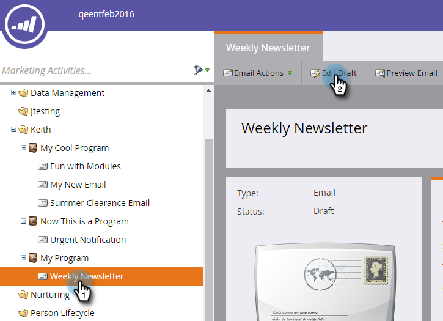
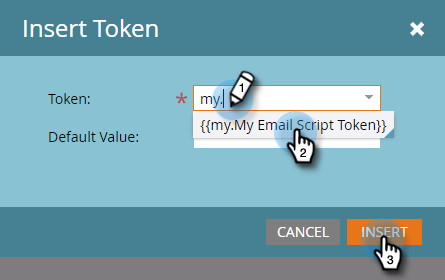

# Aggiungi un token di script e-mail al tuo indirizzo e-mail {#add-an-email-script-token-to-your-email}

Dopo [creato lo script e-mail](/help/marketo/product-docs/email-marketing/general/using-tokens/create-an-email-script-token.md), aggiungilo a un’e-mail per visualizzarla in azione. Ecco come.

>[!NOTE]
>
>La dimensione totale di tutti i token di script inseriti in un’unica e-mail non può superare i 100 KB.

1. Vai a **Attività di marketing** area.

   

1. Trova e seleziona l’e-mail a cui desideri aggiungere il token e fai clic su **Modifica bozza**.

   

   >[!TIP]
   >
   >Puoi anche aggiungere il token a un modello e-mail, se lo desideri.

1. Fare doppio clic sull’area modificabile a cui si desidera aggiungere il token.

   

1. Posiziona il cursore nel punto in cui desideri che sia il token e fai clic sull’icona Inserisci token .

   

1. Trova e seleziona il token di script e-mail creato in precedenza e fai clic su **Inserisci**.

   

   >[!TIP]
   >
   >Se lo desideri, aggiungi un valore predefinito.

1. Fai clic su **Salva**.

   

>[!NOTE]
>
>Non dimenticarti di [approva l’e-mail](/help/marketo/product-docs/email-marketing/general/creating-an-email/approve-an-email.md).

Tutto qui! Quando l’e-mail viene inviata, lo script dietro il token viene eseguito e popolato.
