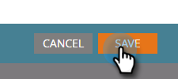

# Aggiungere token a un collegamento e-mail {#add-tokens-to-an-email-link}

Per inserire nei collegamenti parametri aggiuntivi e specifici della persona, puoi utilizzare i token. Ecco come.

1. Selezionare l'indirizzo di posta elettronica e fare clic sulla scheda **[!UICONTROL Edit Draft]**.

   

1. Fare doppio clic su un'area modificabile.

   

1. Individua o scrive il testo del collegamento. Evidenziarlo e fare clic sull'icona **[!UICONTROL Insert/Edit Link]**.

   

1. Digitare i token desiderati in **[!UICONTROL URL]** e fare clic su **[!UICONTROL Insert]**.

   

1. Fai clic su **[!UICONTROL Save]**.

   

   Ed è tutto!

>[!MORELIKETHIS]
>
>[Utilizzo di URL nei miei token](/help/marketo/product-docs/email-marketing/general/using-tokens/using-urls-in-my-tokens.md)
