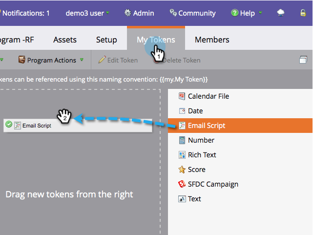

# Creare un token di script e-mail {#create-an-email-script-token}

Per gli sviluppatori avanzati, puoi utilizzare [Script Velocity](https://velocity.apache.org/engine/1.7/user-guide.html) nelle e-mail. Ecco come farlo.

1. Vai a **Attività di marketing**.

   

1. Trova e seleziona un programma (Evento, Predefinito o Coinvolgimento, ecc.).

   

1. Sotto **I miei token** , trascina una **Script e-mail** token.

   

1. Denomina il token dello script e-mail e **fai clic per modificare** il suo contenuto.

   

1. Usa la struttura a destra per trascinare **Persona, opportunità**, o **Oggetto personalizzato** token.

   

   >[!NOTE]
   >
   >Quando accedi a un array (opportunità o oggetto personalizzato) sei limitato ai 10 elementi più recenti associati alla persona.

1. Osserva che il token diventa selezionato/attivo dopo averlo trascinato nell’editor di script.

   

   >[!NOTE]
   >
   >Se digiti token in formato libero, assicurati di controllare/attivare tutti i token corrispondenti nella struttura, altrimenti verranno trattati come testo normale e non funzioneranno.

1. Scrivi il tuo script in Velocity. Di seguito sono riportate alcune risorse utili:

   * [Documentazione sugli script e-mail per sviluppatori Marketo](https://developers.marketo.com/email-scripting/)
   * [Guida utente di Velocity](https://velocity.apache.org/engine/devel/user-guide.html)
   * [Guida di riferimento di Velocity](https://velocity.apache.org/engine/devel/vtl-reference-guide.html)
   * [Strumenti Velocity Javadoc](https://velocity.apache.org/tools/releases/2.0/javadoc/index.html)

1. Una volta completato lo script, fai clic su **Salva**.

   

1. Clic **Salva** ancora una volta.

   

Ora puoi utilizzare questo token nelle e-mail. Eseguirà lo script ogni volta che viene inviato un messaggio e-mail.

>[!MORELIKETHIS]
>
>[Aggiungere un token di script e-mail all’e-mail](/help/marketo/product-docs/email-marketing/general/using-tokens/add-an-email-script-token-to-your-email.md)
