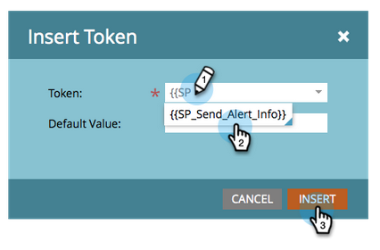

# Utilizza il token di informazioni sull’invio dell’avviso {#use-the-send-alert-info-token-sp-send-alert-info}

Il `{{SP_Send_Alert_Info}}` il token è un token speciale da utilizzare per la creazione di e-mail di avviso per il team di vendita.

>[!TIP]
>
>Questo token funziona solo come previsto per l’invio dell’e-mail che lo contiene con [Invia avviso](/help/marketo/product-docs/core-marketo-concepts/smart-campaigns/flow-actions/send-alert.md) passaggio di flusso. Non funzionerà se utilizzato in un passaggio del flusso Invia e-mail.

Esempio di avviso:

>[!NOTE]
>
>Alzate la testa! Gli URL negli avvisi hanno date di scadenza, quindi assicurati che abbiano una cadenza che supporti questi tipi di messaggi. Le date di scadenza [configurato da un amministratore](/help/marketo/product-docs/administration/settings/edit-link-expiration-in-reports-and-alerts.md).

Le seguenti informazioni sono incluse nel `{{SP_Send_Alert_Info}}`:

* Nome e cognome come collegamento ai dettagli della persona in Marketo
* Un collegamento alla persona nel CRM
* Nome della campagna in Marketo che ha inviato l’avviso
* Ora di invio dell&#39;avviso

>[!NOTE]
>
>Il collegamento al CRM verrà visualizzato solo se la persona si trova nel sistema CRM (attualmente non disponibile con Dynamics CRM). Il collegamento è accessibile sia agli utenti Marketo che a quelli non Marketo.

## Aggiungere il token SP_Send_Alert_Info a un messaggio e-mail {#add-the-sp-send-alert-info-token-to-an-email}

1. Seleziona l’e-mail e fai clic su **Modifica bozza**.

   

1. Fai doppio clic sull’area modificabile a cui desideri aggiungere il token.

   

1. Posiziona il cursore nel punto in cui desideri inserire il token, quindi fai clic sul pulsante **Inserisci token** pulsante.

   

1. Trova e seleziona la **`{{SP_Send_Alert_Info}}`** token e clic **Inserisci**.

   

1. Clic **Salva**.

   

>[!NOTE]
>
>Non dimenticare di approvare l’e-mail.

Buona roba! Questo token è molto utile e devi utilizzarlo in tutti gli avvisi creati per il tuo team vendite.
