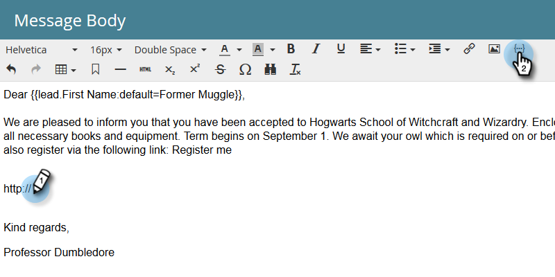

# Utilizzo degli URL nei token personali {#using-urls-in-my-tokens}

Segui i passaggi indicati di seguito per utilizzare i Token personali per inserire gli URL nelle e-mail.

1. Selezionare il programma e fare clic su **My Tokens**.

   

1. Selezionate il **testo** Token personale, trascinatelo e rilasciatelo nell’area di lavoro.

   

1. Assegna al token un nome univoco, immetti un URL (senza http://) e fai clic su **Salva**.

   

   >[!CAUTION]
   >
   >Per essere certi che i clic siano tracciati nel messaggio e-mail, **non** immettete http:// nel valore del token.

1. Selezionate il messaggio e-mail nel programma.

   

1. Fate clic su **Modifica bozza**.

   

1. Fare doppio clic nell&#39;area di testo da modificare.

   

1. In qualsiasi punto del messaggio e-mail, digitate &quot;http://&quot; (senza lasciare spazio dopo) e fate clic sull&#39;icona Inserisci token.

   

   >[!NOTE]
   >
   >Naturalmente potete anche immettere &quot;https&quot; se il sito lo utilizza.

1. Individuate il token personale, selezionatelo e fate clic su **Inserisci**.

   

1. Evidenziate http:// e token, quindi premete Ctrl/Cmd+X (Ctrl = Windows/Cmd = Mac) per tagliare il testo.

   

1. Evidenziare il testo da visualizzare nel collegamento e fare clic sull&#39;icona Inserisci/Modifica collegamento.

   

1. Premete Ctrl/Comando+V per incollare il contenuto nella casella **URL** e fate clic su **Inserisci**.

   

1. Fate clic su **Salva**.

   

   E hai finito! L’URL verrà popolato dopo l’invio e, grazie all’inserimento di http:// davanti al token, verrà generato un collegamento tracciabile.

