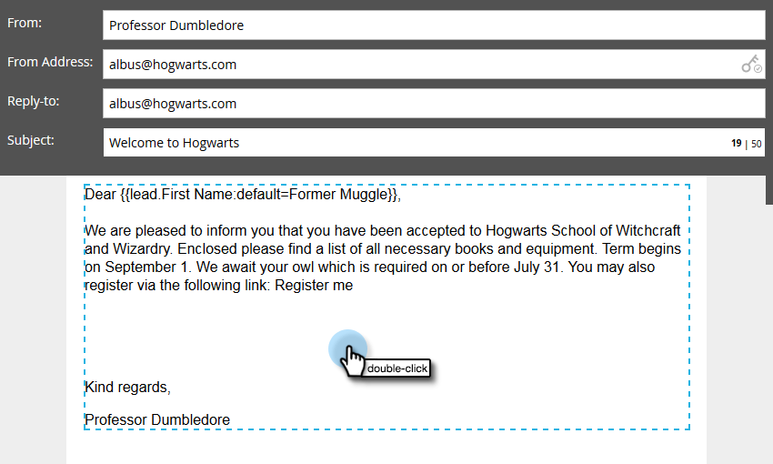

# Utilizzo degli URL nei miei token {#using-urls-in-my-tokens}

Segui i passaggi seguenti per utilizzare [!UICONTROL My Tokens] per inserire gli URL nelle e-mail.

1. Selezionare il programma e fare clic su **[!UICONTROL My Tokens]**.

   

1. Seleziona il token **[!UICONTROL Text]**, trascinalo sull&#39;area di lavoro.

   

1. Assegna al token un nome univoco, immetti un URL (senza https://) e fai clic su **[!UICONTROL Save]**.

   

   >[!CAUTION]
   >
   >**Utilizzo di http/https...**
   >
   >* Per assicurarti che i clic siano tracciati nel messaggio e-mail, **non** immetti https:// _all&#39;interno_ del valore del token. Utilizzalo all’esterno del token, come illustrato nel passaggio 7.
   >
   >* Si consiglia vivamente di non escludere il http/https. Così facendo, la [versione web](/help/marketo/product-docs/email-marketing/general/functions-in-the-editor/add-a-view-as-web-page-link-to-an-email.md){target="_blank"} dell&#39;e-mail potrebbe essere riprodotta in modo errato.

1. Seleziona l’e-mail nel programma.

   

1. Fai clic su **[!UICONTROL Edit Draft]**.

   

1. Fare doppio clic nell&#39;area di testo da modificare.

   

1. In qualsiasi punto dell&#39;e-mail, digita `https://` (senza lasciare spazio dopo) e fai clic sull&#39;icona Inserisci token.

   

   >[!NOTE]
   >
   >Naturalmente puoi anche immettere `http://` se il tuo sito non utilizza https.

1. Individua il token personale, selezionalo e fai clic su **[!UICONTROL Insert]**.

   

1. Evidenziare https:// e il token, quindi premere Ctrl/Comando+X (Ctrl = Windows/Comando = Mac) per tagliare il testo.

   

1. Evidenziare il testo da visualizzare nel collegamento e fare clic sull&#39;icona [!UICONTROL Insert/Edit Link].

   

1. Premere Ctrl/Comando+V per incollare il contenuto nella casella **[!UICONTROL URL]** e fare clic su **[!UICONTROL Insert]**.

   

1. Fai clic su **[!UICONTROL Save]**.

   

   E hai finito! L’URL si popolerà dopo l’invio e, grazie al fatto che inserisci https:// davanti al token, genererà un collegamento tracciabile.
