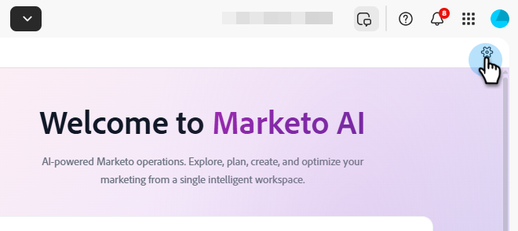

# Impostazioni e configurazione {#settings-setup}

Scopri come abilitare le autorizzazioni e utilizzare l’area Impostazioni per visualizzare i dettagli di connessione, definire regole organizzative e impostare integrazioni e notifiche.

>[!AVAILABILITY]
>
>Questa funzione è attualmente in versione open beta. Per richiedere l’accesso, contatta il tuo account manager. Devi accettare anche i [Termini Gen-AI di base e i termini supplementari](https://www.adobe.com/legal/terms/enterprise-licensing/genai-ww.html){target="_blank"}.

## Autorizzazioni e ruoli {#permission-and-role}

Sono disponibili un&#39;autorizzazione _Accedi a Marketo AI_ e un ruolo _Utente di Marketo AI_, che offre agli amministratori un maggiore controllo sugli utenti che possono accedere alla funzionalità **Marketo AI**. L’autorizzazione viene assegnata a livello di ruolo. Il ruolo _Utente di Marketo AI_ include l&#39;autorizzazione _Accesso a Marketo AI_ abilitata per impostazione predefinita.

>[!IMPORTANT]
>
>L&#39;autorizzazione _Accesso a Marketo AI_ non è attivata per impostazione predefinita per tutti i ruoli. Per ulteriori informazioni, consulta la tabella seguente.

| Ruolo | Stato predefinito |
| --- | --- |
| Amministratore | Abilitata |
| Amministratore di prodotto Adobe | Abilitata |
| Utente marketing | Disabilitata |
| Utente standard | Non disponibile |
| Utente Marketo AI | Abilitata |
| Ruoli personalizzati | Disabilitata |

### Accesso all’autorizzazione di Marketo AI {#access-marketo-ai-permission}

Segui i passaggi seguenti per abilitare _Access Marketo AI_ per i ruoli idonei per i quali non è già abilitato.

1. Nel tuo My Marketo, fai clic su **Amministratore**, quindi su **Utenti e ruoli**.

   

1. Nella scheda _Ruoli_, seleziona il ruolo desiderato e fai clic su **Modifica ruolo**.

   

1. Scorri verso il basso e seleziona la casella di controllo _Accedi a Marketo AI_, quindi fai clic su **Salva**.

   

   >[!NOTE]
   >
   >Per rimuovere l&#39;autorizzazione, segui la stessa procedura selezionando la casella di controllo _Accedi a Marketo AI_ in **un**.

### Ruolo utente di Marketo AI {#marketo-ai-user-role}

Segui questi passaggi per assegnare un utente specifico al ruolo _Utente di Marketo AI_.

>[!NOTE]
>
>Questo ruolo **only** contiene l&#39;autorizzazione _Access Marketo AI_.

1. Nel tuo My Marketo, fai clic su **Amministratore**, quindi su **Utenti e ruoli**.

   

1. Selezionare l&#39;utente desiderato e fare clic su **Modifica utente**.

   

1. In _Ruoli e aree di lavoro_, seleziona la casella di controllo _Utente di Marketo AI_. Se si dispone di più aree di lavoro, è possibile specificare a quali di esse è consentito l&#39;accesso nel menu a discesa del segno **+**. Al termine, fai clic su **Salva**.

   

### Ruolo personalizzato {#custom-role}

È inoltre possibile [creare un nuovo ruolo](https://experienceleague.adobe.com/it/docs/marketo/using/product-docs/administration/users-and-roles/create-delete-edit-and-change-a-user-role#create-a-role){target="_blank"} e personalizzarne le autorizzazioni, aggiungendo _Access Marketo AI_, insieme a qualsiasi altro elemento desiderato, e [assegnare tale ruolo](https://experienceleague.adobe.com/it/docs/marketo/using/product-docs/administration/users-and-roles/managing-user-roles-and-permissions#assign-roles-to-a-user){target="_blank"} a utenti specifici.

## Impostazioni {#settings}

1. Nel Marketo personale, fare clic sul riquadro **[!UICONTROL Marketo AI]**.

   

1. Fai clic sull’icona a forma di ingranaggio.

   

### Connessione {#connection}

Questa scheda non contiene campi modificabili. Mostra informazioni sull’account, come il tuo Munchkin ID e l’organizzazione IMS.

### Regole organizzative {#organizational-rules}

Definisci le linee guida e i vincoli organizzativi che Marketo AI segue durante la creazione o la modifica di risorse Marketo Engage.

{width="800" zoomable="yes"}

>[!NOTE]
>
>Le regole utilizzano il formato Markdown con il frontmatter YAML. Le regole globali si applicano a tutte le aree di lavoro. Le regole di Workspace sovrascrivono le impostazioni globali.

### Integrazioni (presto disponibili) {#integrations}

Configurare le connessioni a servizi e API esterni.

_Questa scheda può essere visualizzata nell&#39;interfaccia utente, ma non è ancora disponibile. Controlla di nuovo la disponibilità di aggiornamenti_.

### Notifiche (disponibili a breve) {#notifications}

Gestisce le preferenze degli avvisi e i canali di notifica.

_Questa scheda può essere visualizzata nell&#39;interfaccia utente, ma non è ancora disponibile. Controllare la disponibilità di aggiornamenti in questo articolo_.
