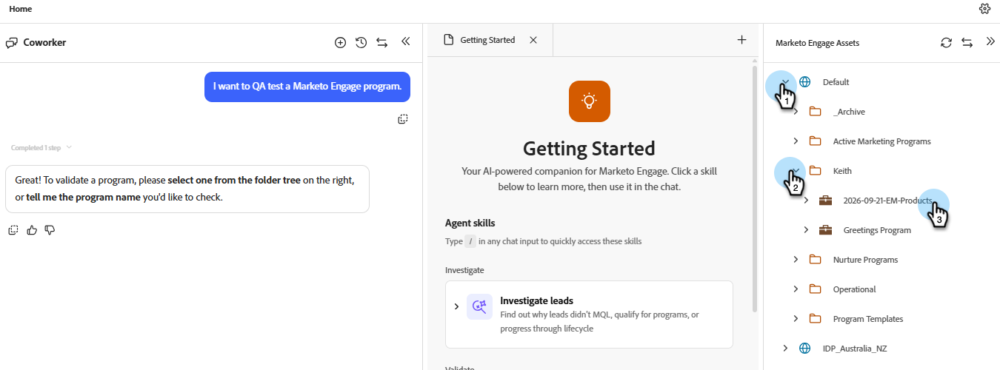

# Convalida programmi {#validate-programs}

Controlla i programmi per scoprire le best practice per tutti i componenti, ad esempio e-mail, pagine di destinazione, campagne e altro ancora.

## Come usare {#how-to-use}

1. In Il mio Marketo, fai clic sul riquadro **IA per Marketo**.

   

1. Selezionare l&#39;abilità **Convalida programmi**.

1. Selezionare il programma da convalidare nel riquadro di destra.

   {width="800" zoomable="yes"}

   Nel riquadro centrale viene visualizzato un riepilogo del programma selezionato.

1. Nella finestra del prompt, immetti &quot;convalida programma&quot; e fai clic su **Invia**.

   L&#39;Assistente IA fornisce un controllo qualità del programma selezionato, mostrando cosa è stato passato e cosa non è riuscito.

   
