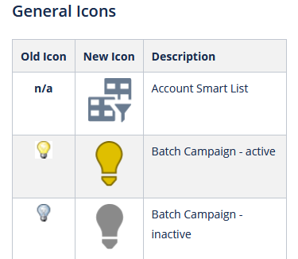

# Panoramica {#overview}

Benvenuti in Adobe Marketo Engage Modern UX (user experience), un’interfaccia aggiornata che offre una migliore usabilità e un nuovo aspetto sulla piattaforma del Marketo Engage.

>[!PREREQUISITES]
>
>Se il tuo team IT limita l’accesso web utilizzando un inserisco nell&#39;elenco Consentiti di, chiedi loro di aggiungere i seguenti domini (incluso l’asterisco) per consentire tutte le risorse e i websockets di Marketo:
>
>* *.marketo.com
>* *.marketodesigner.com
>* *.mktoweb.com

## Novità {#whats-new}

Nell’esperienza utente moderna sono presenti molte nuove funzionalità, progettate per migliorare in modo significativo la tua esperienza di marketing.

**Icone**

La nuova interfaccia presenta un&#39;iconografia migliorata ed estesa. Per saperne di più: [Icona Glossario](/help/marketo/product-docs/marketo-engage-modern-ux/icon-glossary.md).

**Navigazione globale**

Arrivederci superball. Ora puoi accedere rapidamente a tutte le sezioni principali del Marketo Engage.

**URL istanza**

Inoltre, puoi accedere rapidamente al tuo ID munchkin, che ora si riflette nell’URL dell’istanza (ancora più utile per chi ha più abbonamenti).

## Nuove opzioni albero {#new-tree-options}

Sono disponibili numerose nuove funzionalità dell&#39;albero.

>[!NOTE]
>
>Quando si esegue una ricerca nella struttura, vengono visualizzati solo i primi 250 risultati. Se dopo una ricerca non riesci a individuare la risorsa, utilizza [Ricerca globale](/help/marketo/product-docs/marketo-engage-modern-ux/using-the-global-search.md) funzione.

**Confronto tra Marketo Classic e il nuovo Marketo**

<table> 
 <tbody>
  <tr>
   <th>Funzione</th> 
   <th>Classic</th> 
   <th>Di nuova generazione</th> 
  </tr>
  <tr>
   <td>Applicare più filtri contemporaneamente</td> 
   <td></td> 
   <td><strong>X</strong></td>  
  </tr>
  <tr>
   <td>Nodo combinato struttura bozza e approvazione</td> 
   <td></td> 
   <td><strong>X</strong></td> 
  </tr>
  <tr>
   <td>Creare risorse locali nelle cartelle dei programmi</td> 
   <td></td> 
   <td><strong>X</strong></td> 
  </tr>
  <tr>
   <td>Fare doppio clic per espandere/comprimere i nodi della struttura</td> 
   <td><strong>X</strong></td> 
   <td><strong>X</strong></td>  
  </tr>
  <tr>
   <td>Trascinamento della selezione dalla struttura al flusso di coinvolgimento</td> 
   <td><strong>X</strong></td> 
   <td></td> 
  </tr>
  <tr>
   <td>Trascinare all'interno della struttura</td> 
   <td><strong>X</strong></td> 
   <td><strong>X</strong></td> 
  </tr>
  <tr>
   <td>Filtra per tipo di risorsa e stati</td> 
   <td><i>parziale</i></td> 
   <td><strong>X</strong></td>  
  </tr>
  <tr>
   <td>Evidenzia sfondo per mostrare la gerarchia nello stato attivo</td> 
   <td></td> 
   <td><strong>X</strong></td> 
  </tr>
  <tr>
   <td>Evidenziazione delle parole chiave durante la ricerca</td> 
   <td></td> 
   <td><strong>X</strong></td> 
  </tr>
  <tr>
   <td>Scorrimento orizzontale</td> 
   <td><strong>X</strong></td> 
   <td><strong>X</strong></td>  
  </tr>
  <tr>
   <td>Stato al passaggio del mouse dei nodi della struttura</td> 
   <td><strong>X</strong></td> 
   <td><strong>X</strong></td> 
  </tr>
  <tr>
   <td>Comprimi rapidamente l'intera struttura</td> 
   <td></td> 
   <td><strong>X</strong></td> 
  </tr>
  <tr>
   <td>Comprimi rapidamente nel nodo principale</td> 
   <td></td> 
   <td><strong>X</strong></td>  
  </tr>
  <tr>
   <td>Aggiornamento in tempo reale</td> 
   <td></td> 
   <td><strong>X</strong></td> 
  </tr>
  <tr>
   <td>Struttura ridimensionabile</td> 
   <td><strong>X</strong></td> 
   <td><strong>X</strong></td> 
  </tr>
  <tr>
   <td>Cerca nelle cartelle archiviate</td> 
   <td></td> 
   <td><strong>X</strong></td>  
  </tr>
  <tr>
   <td>Stringa di ricerca salvata durante l'immissione della ricerca globale dalla ricerca ad albero</td> 
   <td></td> 
   <td><strong>X</strong></td> 
  </tr>
  <tr>
   <td>Mostra tutte le aree di lavoro in un unico albero</td> 
   <td><strong>X</strong></td> 
   <td><strong>X</strong></td> 
  </tr>
  <tr>
   <td>Badge di stato e descrizioni</td> 
   <td></td> 
   <td><strong>X</strong></td>  
  </tr>
  <tr>
   <td>Logica di ricerca 'Word starts with'</td> 
   <td></td> 
   <td><strong>X</strong></td> 
  </tr>
 </tbody>
</table>

## Navigazione globale {#global-nav}

Dai un&#39;occhiata al nuovo Global Nav.

<table> 
 <tbody>
  <tr>
   <td>1</td> 
   <td>Nessun altro menu a discesa superball</td> 
  </tr>
  <tr>
   <td>2</td> 
   <td>Tutti gli elementi superball precedenti elencati</td> 
  </tr>
  <tr>
  <tr>
   <td>3</td> 
   <td>Se hai più abbonamenti, fai clic sul tuo nome secondario per passare facilmente a un altro</td> 
  </tr>
  <tr>
   <td>4</td> 
   <td>Ricerca globale: da qui è ora possibile eseguire una ricerca nell’intera istanza</td> 
  </tr>
 </tbody>
</table>

>[!NOTE]
>
>Tutto ciò che una volta viveva nel menu a discesa superball è ancora disponibile come sezione nel tuo My Marketo.

>[!TIP]
>
>L’utilizzo della ricerca nella struttura produrrà risultati solo dalla sezione in cui ti trovi (ad esempio, Attività di marketing). Se desideri cercare nell’intera istanza, utilizza la ricerca globale.

Godetevi la nuova esperienza di Marketo Engage!
