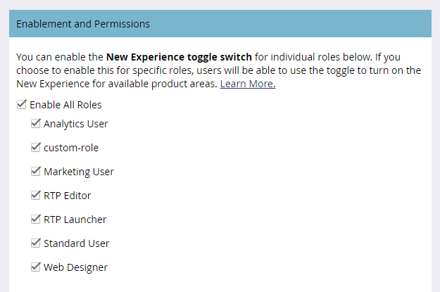

# Attiva/Disattiva {#toggle-switch}

L&#39;interruttore di attivazione consente di passare dall&#39;interfaccia classica di Marketo all&#39;interfaccia utente moderna. È disponibile in tutte le aree evidenziate di seguito.

>[!NOTE]
>
>Quando l’opzione Attiva/Disattiva è selezionata, tutti i flussi di lavoro esistenti vengono salvati automaticamente prima della modifica dell’interfaccia utente. Se è già in corso un’operazione (ad esempio, se una risorsa è in fase di approvazione), riceverai un messaggio di errore che la indica come tale e riprova al termine dell’operazione.

## Attiva interruttore di attivazione per singoli ruoli {#enable-the-toggle-switch-for-individual-roles}

Attiva l’interruttore di attivazione per i singoli ruoli o per tutti i ruoli. Ecco come.

1. In Marketo Engage, fai clic su **Amministratore**.

   

1. Clic **Nuova esperienza**.

   

1. Selezionare i ruoli ai quali si desidera consentire l&#39;accesso all&#39;interruttore di attivazione.

   

## Attiva per funzioni {#enable-for-features}

È possibile abilitare manualmente l&#39;interfaccia utente moderna del Marketo Engage per singole funzioni o tutte le funzioni disponibili (correnti e future).

In un’area che al momento dispone dell’interruttore di attivazione (in questo esempio ci troviamo nella visualizzazione Elenco e-mail), fai clic sull’opzione in basso a destra della pagina.

La nuova esperienza verrà caricata.

Per abilitarlo per _tutto_ funzioni, fai clic sull’icona a forma di ingranaggio accanto all’interruttore di attivazione.

Seleziona **Attiva per tutte le funzioni disponibili** e fai clic su **OK**.

## Funzioni disponibili {#available-features}

Nell’interfaccia utente moderna sono attualmente disponibili le seguenti funzioni (con nuove funzioni aggiunte a ogni versione):

* Visualizzazione dettagli e-mail
* Visualizzazione elenco e-mail
* Visualizzazione dettagli modello e-mail
* Lista dei Modelli di Email
* Visualizzazione dashboard prova e-mail
* Visualizzazione dettagli modulo
* Visualizzazione elenco moduli
* Pagina Dettagli immagini e file
* Visualizzazione dettagli pagina di destinazione
* Visualizzazione elenco pagine di destinazione
* Dettagli del modello della pagina di destinazione
* Elenco modelli pagina di destinazione
* Visualizzazione dettagli frammento
* Vista elenco snippet

