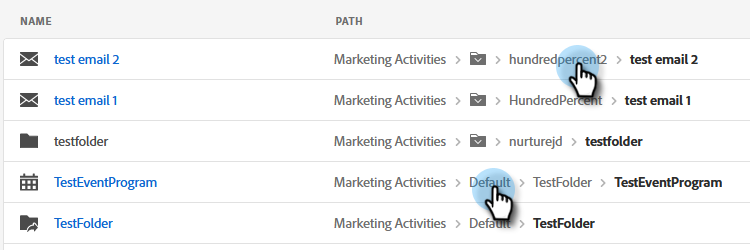
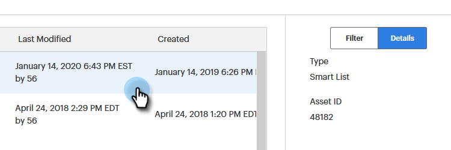
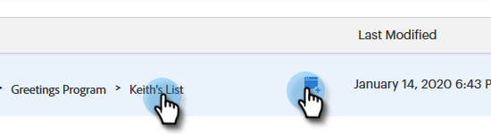

# Utilizzo della ricerca globale {#using-the-global-search}

La potente ricerca globale offre un sacco di opzioni senza limiti sui risultati visualizzati.

## Risultati completamento automatico {#autocomplete-results}

A volte autocomplete mostrerà rapidamente esattamente quello che stai cercando.

1. Nella barra di navigazione globale, fai clic su **Cerca**.

   

1. Digita il testo di identificazione della risorsa.

   

1. Vengono visualizzati i risultati della ricerca con completamento automatico. Puoi fare clic in un punto qualsiasi delle breadcrumb per passare direttamente a tale elemento.

   

1. In questo esempio, scegliamo di essere portati direttamente alla lista che stiamo cercando. Fare clic sul nome dell&#39;elenco.

   

Viene visualizzato direttamente l&#39;elenco desiderato.

## Risultati della ricerca globale {#global-search-results}

Utilizza la ricerca completa se i risultati di completamento automatico non mostrano quello che stai cercando.

1. Nella barra di navigazione globale, fai clic su **Cerca**.

   

1. Digita il testo di identificazione della risorsa e fai clic su **Cerca**.

   

1. Viene visualizzata la pagina Risultati ricerca globale .

   

<table> 
 <tbody>
  <tr>
   <td>1</td> 
   <td>Prima pagina (o solo) di tutti i risultati della ricerca, fai clic in un punto qualsiasi delle breadcrumb da portare direttamente a quell'area</td> 
  </tr>
  <tr>
   <td>2</td> 
   <td>Date/ore di creazione/ultima modifica dell’elemento</td> 
  </tr>
  <tr>
   <td>1</td> 
   <td>Scegliere una specifica sezione principale di Marketo per eseguire ricerche o eseguire ricerche in una sola volta</td> 
  </tr>
  <tr>
   <td>4</td> 
   <td>Implementare filtri mirati per limitare i risultati della ricerca</td> 
  </tr>
 </tbody>
</table>

PASSAGGIO OPZIONALE: Per utilizzare il filtro, scegli le opzioni e fai clic su **Applica**.

PASSAGGIO OPZIONALE: Per visualizzare i dettagli di un elemento, fai clic su nello &quot;spazio vuoto&quot; della riga.

PASSAGGIO OPZIONALE: Per passare direttamente all&#39;ultimo elemento di una breadcrumb, fai clic su di esso, OPPURE, passa il mouse sullo &quot;spazio vuoto&quot; nella sua riga fino a quando non viene visualizzata l&#39;icona sottostante, e fai clic su di esso.

