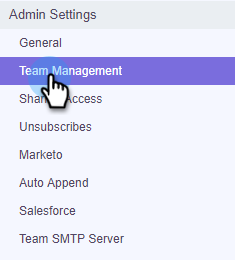
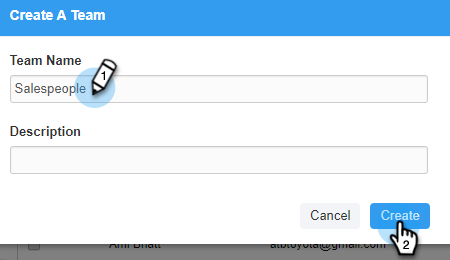

# Creare un sottoteam {#create-a-sub-team}

## Creare un sottoteam {#create-a-sub-team-1}

1. Fai clic sull’icona a forma di ingranaggio e seleziona **Impostazioni**.

   

1. In Impostazioni amministratore, seleziona **Gestione team**.

   

1. Accanto a Tutti i team, fai clic sul pulsante **+**.

   

1. Inserisci un nome del team (e una descrizione facoltativa) e fai clic su **Crea**.

   

   >[!NOTE]
   >
   >Ora puoi condividere modelli, campagne e gruppi con quel team.

## Aggiungi persone al tuo sottoteam {#add-people-to-your-sub-team}

1. Sempre in Gestione team, seleziona la **Tutti** gruppo.

   

1. Individua gli utenti da aggiungere al tuo sottoteam e seleziona la relativa casella di controllo.

   

1. Fai clic su **Aggiungi selezionati ai team**.

   

1. Fai clic sull’elenco a discesa e seleziona il team desiderato.

   

1. Fai clic su **Aggiungi ai team** al termine.

   
