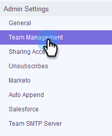

# Invita membri del team {#invite-team-members}

Aggiungere membri del team è semplice e veloce!

1. Fare clic sull'icona dell'ingranaggio e selezionare **Impostazioni**.

   

1. In Impostazioni amministratore, seleziona **Gestione team**.

   

1. Fare clic su **Invita nuovo utente**.

   

1. Inserite gli indirizzi e-mail degli utenti che desiderate aggiungere e fate clic su **Next**.

   

   >[!NOTE]
   >
   >Per impostazione predefinita, tutti i nuovi membri verranno aggiunti al team Tutti.

1. Fare clic su **OK**.

   
