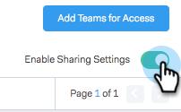

# Impostazioni di condivisione {#sharing-settings}

Gestire meglio i modelli limitando gli elementi che gli utenti possono condividere e con quali categorie.

Quando l&#39;account di vendita Connect viene creato per la prima volta, le impostazioni di condivisione sono abilitate. Questo offre agli amministratori di account la possibilità di creare e organizzare le categorie dei modelli prima di aprire i gateway e consente agli utenti di condividere i contenuti nelle categorie del team.

Quando le impostazioni di condivisione sono abilitate, solo gli amministratori possono condividerle in categorie a meno che non vengano forniti privilegi di condivisione a un team o a tutti. Se le impostazioni di condivisione sono disattivate, non sono previste restrizioni e tutti gli utenti possono condividere i dati in qualsiasi categoria di modelli.

## Configurare le impostazioni di condivisione {#configure-your-sharing-settings}

1. Nell&#39; [applicazione Web](http://toutapp.com/login), passare alla pagina Settings (Impostazioni).

   

1. In Impostazioni amministratore, seleziona **Condivisione accesso**.

   

1. Assicurarsi che **Impostazioni di condivisione** siano abilitate. Questo significa che per impostazione predefinita solo gli amministratori possono condividere i modelli nelle categorie dei modelli.

   

1. Selezionate la categoria di modelli da configurare.

   

1. Fare clic su **Aggiungi team per l&#39;accesso**.

   

1. Selezionate i team da aggiungere.

   

   >[!NOTE]
   >
   >Se non visualizzi alcun team, dovrai andare in Gestione team e creare un team di utenti.

1. Fare clic su **Aggiungi team per Access** per salvare.

   

1. Ora che il team è stato aggiunto, potete scegliere se consentire la condivisione solo agli amministratori del team o a tutti gli utenti del team. In questo esempio abbiamo dato a tutti gli utenti del SDR l&#39;accesso per la condivisione del team.

   

