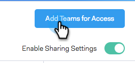

# Impostazioni di condivisione {#sharing-settings}

Gestisci meglio i modelli limitando ciò che gli utenti possono condividere e con quali categorie.

Quando si crea l&#39;account Sales Connect per la prima volta, vengono attivate le impostazioni di condivisione. In questo modo gli amministratori del tuo account possono creare e organizzare le categorie di modelli prima di aprire i portali e consentire agli utenti di condividere i contenuti nelle categorie del team.

Quando le impostazioni di condivisione sono abilitate, solo gli amministratori possono condividere in categorie, a meno che non vengano forniti privilegi di condivisione a un team o a tutti. Se le impostazioni di condivisione sono disattivate, non vi sono restrizioni e tutti gli utenti possono condividere in qualsiasi categoria di modelli.

## Configurare Le Impostazioni Di Condivisione {#configure-your-sharing-settings}

1. Nella sezione [applicazione web](https://toutapp.com/login), passa alla pagina Impostazioni.

   

1. In Impostazioni amministratore, seleziona **Condivisione dell&#39;accesso**.

   

1. Assicurati che **Impostazioni di condivisione** sono attivati. Ciò significa che, per impostazione predefinita, solo gli amministratori potranno condividere i modelli nelle categorie dei modelli.

   

1. Seleziona la Categoria modello da configurare.

   

1. Clic **Aggiungi team per l&#39;accesso**.

   

1. Seleziona i team da aggiungere.

   

   >[!NOTE]
   >
   >Se non trovi team, devi passare a Gestione team e creare un team di utenti.

1. Clic **Aggiungi team per l&#39;accesso** per salvare.

   

1. Dopo aver aggiunto il team, puoi scegliere di consentire solo agli amministratori del team di condividere o tutti gli utenti del team. In questo esempio abbiamo dato a tutti gli utenti del team SDR l’accesso condiviso.

   
