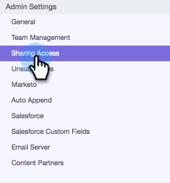
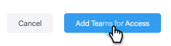

# Impostazioni di condivisione {#sharing-settings}

Gestisci meglio i modelli limitando ciò che gli utenti possono condividere e con quali categorie.

Quando il tuo account Sales Connect viene creato per la prima volta, [!UICONTROL Sharing Settings] viene abilitato. In questo modo gli amministratori del tuo account possono creare e organizzare le categorie di modelli prima di aprire i portali e consentire agli utenti di condividere i contenuti nelle categorie del team.

Quando [!UICONTROL Sharing Settings] è abilitato, solo gli amministratori potranno condividere in categorie, a meno che non vengano forniti privilegi di condivisione a un team o a tutti. Se [!UICONTROL Sharing Settings] è disabilitato, non ci sono restrizioni e tutti gli utenti possono condividere in qualsiasi categoria di modelli.

## Configurare Le Impostazioni Di Condivisione {#configure-your-sharing-settings}

1. Nell&#39;[applicazione Web](https://toutapp.com/login), passare alla pagina [!UICONTROL Settings].

   

1. In [!UICONTROL Admin Settings], selezionare **[!UICONTROL Sharing Access]**.

   

1. Assicurarsi che **[!UICONTROL Sharing Settings]** siano abilitati. Ciò significa che, per impostazione predefinita, solo gli amministratori potranno condividere i modelli nelle categorie dei modelli.

   

1. Seleziona la Categoria modello da configurare.

   

1. Fai clic su **[!UICONTROL Add Teams for Access]**.

   

1. Seleziona i team da aggiungere.

   

   >[!NOTE]
   >
   >Se non trovi team, devi passare a Gestione team e creare un team di utenti.

1. Fare clic su **[!UICONTROL Add Teams for Access]** per salvare.

   

1. Dopo aver aggiunto il team, puoi scegliere di consentire solo agli amministratori del team di condividere o tutti gli utenti del team. In questo esempio abbiamo dato a tutti gli utenti del team SDR l’accesso condiviso.

   
