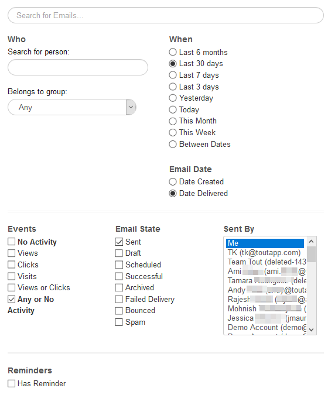

# Dettagli accesso utente {#user-access-details}

A cosa hanno accesso amministratori e non amministratori?

## Autorizzazioni utente amministratore {#admin-user-permissions}

Gli amministratori possono [visualizzare tutti i modelli](/help/marketo/product-docs/marketo-sales-connect/templates/view-template-list-as-a-another-user.md).

Gli amministratori possono [visualizzare tutte le campagne](/help/marketo/product-docs/marketo-sales-connect/campaigns/view-campaigns-list-as-another-user.md).

Gli amministratori possono visualizzare tutte le attività relative alle e-mail.

Gli amministratori possono vedere tutte le persone in una campagna in corso.

Tutti i record relativi alle persone sono accessibili nel gruppo Everyone.

Gli amministratori possono interrompere le campagne per conto degli utenti.

## Autorizzazioni utente non amministratore {#non-admin-user-permissions}

* Analytics:

   * Gli utenti possono visualizzare l&#39;analisi del team
   * Gli utenti possono esplorare solo i team a cui appartengono
   * Gli utenti possono visualizzare le proprie analisi

* Pagina Relazioni:

   * Gli utenti possono condividere i gruppi con tutti
   * Gli utenti possono condividere i gruppi solo con i team a cui appartengono
   * Quando un utente viene eliminato, i suoi contatti condivisi trasferiscono la proprietà all&#39;Amministratore principale che ha eliminato l&#39;utente

* Foto di vendita - Feed successivo e live:

   * Gli utenti possono visualizzare la visualizzazione &quot;tutti&quot;
   * Gli utenti possono filtrare in base al team a cui appartengono
   * Gli utenti possono condividere i post con tutti
   * Gli utenti possono condividere i post solo con i team a cui appartengono

* Pagina Gestione team:

   * Impossibile visualizzare

* Pagina Modelli:

   * Gli utenti possono condividere i modelli con tutti
   * Gli utenti possono condividere i modelli in categorie che gli amministratori consentono di
   * Quando un utente viene rimosso da un team, i suoi modelli non vengono condivisi con tale team
   * Quando un utente viene eliminato da un team, i suoi modelli trasferiscono la proprietà all&#39;Amministratore principale che ha eliminato l&#39;utente
