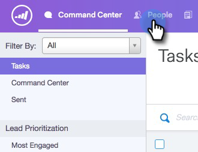

# Aggiungi a campagna di marketing {#add-to-marketing-campaign}

>[!PREREQUISITES]
>
>[Rendere una campagna visibile agli utenti di vendita](/help/marketo/product-docs/marketo-sales-connect/marketo/make-a-campaign-visible-to-sales-connect-users.md)

## Aggiungere singoli utenti a una campagna {#add-individuals-to-a-campaign}

>[!NOTE]
>
>Per aggiungere una persona a una campagna Marketo da Sales Connect, Sales Connect deve disporre dell&#39;ID lead Marketo della persona.

1. Fai clic sul pulsante **Persone** Tab.

   

1. Trova i contatti che desideri aggiungere.

   

1. Fai clic sulla casella di controllo per selezionare i contatti.

   

1. Fai clic su **Aggiungi selezionati alla campagna**.

   

1. Poiché stai aggiungendo a una campagna di marketing, salta la selezione di un indirizzo &quot;da&quot;. È tuttavia possibile scegliere di aggiungere altri contatti. Se lo si sceglie, fare clic su Individui e digitare il testo desiderato. Fai clic su **Successivo** al termine.

   

1. Fai clic su **Campagna di marketing**.

   

1. Fai clic sull’elenco a discesa Aree di lavoro e scegli l’area di lavoro contenente la campagna a cui desideri aggiungere il gruppo.

   

   >[!NOTE]
   >
   >Se l&#39;area di lavoro desiderata non è visibile, assicurati che l&#39;amministratore la distribuisca tramite la pagina Marketo Team Access.

1. Seleziona la campagna desiderata e fai clic su **Successivo**.

   

1. Vengono visualizzati i contatti idonei. Fai clic su **Inizio** per farli aggiungere.

   

## Aggiungere un gruppo a una campagna {#add-a-group-to-a-campaign}

1. Fai clic sul pulsante **Persone** Tab.

   

1. In Gruppi personali, selezionate il gruppo da aggiungere a una campagna.

   

1. Fai clic su **Aggiungi gruppo a campagna**.

   

1. Poiché stai aggiungendo a una campagna di marketing, salta la selezione di un indirizzo &quot;da&quot;. È tuttavia possibile scegliere di aggiungere altri contatti. Se lo si sceglie, fare clic su Individui e digitare il testo desiderato. Fai clic su **Successivo** al termine.

   

1. Seleziona **Campagna di marketing**.

   

   >[!NOTE]
   >
   >Per aggiungere una persona a una campagna Marketo da Sales Connect, Sales Connect deve disporre dell&#39;ID lead Marketo della persona.

1. Fai clic sull’elenco a discesa Aree di lavoro e scegli l’area di lavoro contenente la campagna a cui desideri aggiungere il gruppo.

   

   >[!NOTE]
   >
   >Se l&#39;area di lavoro desiderata non è visibile, assicurati che l&#39;amministratore la distribuisca tramite la pagina Marketo Team Access.

1. Seleziona la campagna desiderata e fai clic su **Successivo**.

   

1. Vengono visualizzati i contatti idonei. Fai clic su **Inizio** per farli aggiungere.

   
