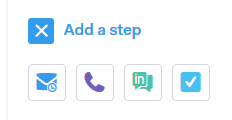

# Tipi di passaggi della campagna {#campaign-step-types}

Quando aggiungi un passaggio alla campagna, avrai a disposizione quattro opzioni.

## E-mail {#email}

Componi una nuova e-mail o utilizza un modello preesistente.

| **Utilizzare un modello** | Seleziona uno dei modelli esistenti |
|---|---|
| **Salva come modello** | Salva l’e-mail appena composta come nuovo modello |
| **Aggiungi contenuto** | Carica un file sul nostro server e ricevi un URL (che punta al contenuto) che può essere tracciato nella tua e-mail |
| **Allega file** | Allegare un file dal computer all&#39;e-mail (limite di dimensione di 23 MB) |

>[!TIP]
>
>Scopri i dettagli [opzioni di invio](/help/marketo/product-docs/marketo-sales-connect/campaigns/understanding-send-options.md).

## Chiamata {#call}

Imposta un promemoria da seguire con un contatto via telefono. Puoi anche salvare le note da utilizzare come traccia vocale durante la chiamata.

## InMail {#inmail}

Seguire più canali è un ottimo modo per connettersi con i lead. Con le attività InMail, è possibile impostare un promemoria per raggiungere tramite LinkedIn.

## Attività personalizzata {#custom-task}

Utilizzare attività personalizzate quando le opzioni di cui sopra non sono applicabili. Ad esempio, puoi invitare un collega a seguire un lead via e-mail.

