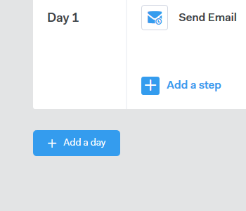

# Creare una campagna {#create-a-campaign}

Le campagne sono una serie di passaggi per più canali, tra cui: e-mail, telefonate, InMail e attività personalizzate. Consentono di semplificare le comunicazioni con i clienti potenziali ed esistenti.

Con le campagne è possibile:

* **Organizza**: Semplificate tutte le attività di sensibilizzazione in un unico luogo per un&#39;esecuzione efficiente.

* **Scala**: Pianificate tutti i vostri sforzi di sensibilizzazione in modo da poter ridurre al minimo il lavoro manuale e personalizzare quanto necessario.
* **Misura**: Monitora il successo di tutte le tue e-mail e le tue attività in un&#39;unica posizione durante l&#39;accesso automatico a Salesforce. Conoscendo le risonanze e i risultati ottenuti, potete sottoporre a test e migliorare i risultati in modo coerente.

Quindi, come si configura una campagna?

1. Fare clic sulla scheda **Campagne**.

   

1. Selezionate una categoria e fate clic sul pulsante **Crea una campagna** per creare una nuova campagna.

   

   >[!NOTE]
   >
   >Per creare una nuova categoria, fare clic su **+** accanto a **Categorie**.

1. La categoria scelta verrà selezionata. Se cambi idea, fai clic sul menu a discesa e selezionane uno diverso. Al termine, fare clic su **Continue**.

   

1. Fare clic su **Aggiungi un passo**.

   

1. Scegli tra: E-mail, Call, InMail o Attività Personalizzata. In questo esempio abbiamo scelto [Email](/help/marketo/product-docs/marketo-sales-connect/campaigns/campaign-step-types.md#email).

   

1. Dopo aver creato il primo giorno e il primo passaggio, il pulsante &quot;Aggiungi un giorno&quot; si attiva e puoi aggiungere tutti i giorni e i passaggi necessari per il processo di vendita.

   

   >[!NOTE]
   >
   >&quot;Giorni&quot; non è il numero di giorni tra le azioni, ma il giorno all’interno della sequenza. Ad esempio, se la campagna avrà una durata di 7 giorni, inserendo &#39;3&#39; l&#39;azione verrà eseguita il giorno 3 di 7, **not** 3 giorni dopo.

1. Assicurati di personalizzare la pianificazione e le opzioni di risposta, ad esempio saltare i fine settimana (che è fantastico) visitando la **scheda Settings** per la campagna.

   

   Ora è il momento di iniziare ad aggiungere persone alla tua campagna!
