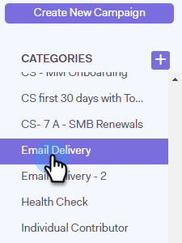

# Rimuovere persone da una campagna {#remove-people-from-a-campaign}

Puoi terminare automaticamente una campagna quando un destinatario risponde. Puoi inoltre scegliere di contrassegnare la campagna come un &quot;successo&quot; per quel destinatario.

Per impostare questa impostazione, dopo aver creato la campagna, è sufficiente selezionare le caselle Annulla sottoscrizione nella sezione Impostazioni della scheda Campagne. Entrambe queste opzioni termineranno la campagna e il destinatario non riceverà più e-mail da te. È necessario disporre del monitoraggio delle risposte per far sì che questo funzioni.

Inoltre, puoi rimuovere persone dalla campagna stessa, rimuovere persone da una campagna all’interno della pagina Persone e rimuovere un intero gruppo di persone. Diamo un&#39;occhiata ai tre metodi seguenti.

## Rimuovere una persona direttamente da una campagna {#remove-a-person-directly-from-a-campaign}

1. In Sales Connect, fare clic sul pulsante **Campagne** scheda .

   

1. Trova la campagna e selezionala.

   

1. La campagna viene visualizzata a destra. Fai clic in un punto qualsiasi per aprirlo.

   

1. Individua la persona da rimuovere e fai clic su **Rimuovi**.

   

1. (FASE FACOLTATIVO) È inoltre possibile rimuovere più persone contemporaneamente facendo clic sulle caselle di controllo accanto ai loro nomi e facendo clic sul pulsante **Rimuovi** in alto.

   

## Rimuovere una persona da una campagna all’interno della pagina Persone {#remove-a-person-from-a-campaign-within-the-people-page}

1. In Sales Connect, fare clic sul pulsante **Persone** scheda .

   

1. Trova e seleziona la persona da rimuovere.

   

1. Il pannello Visualizzazione dettagli persona si apre a destra. Fai clic sul pulsante **Cronologia** scheda seguita da **Rimuovi** pulsante .

   

## Rimuovere un gruppo di persone da una campagna {#remove-a-group-of-people-from-a-campaign}

1. In Sales Connect, fare clic sul pulsante **Persone** scheda .

   

1. Trova e seleziona il gruppo in **Gruppi personali**.

   

1. Seleziona le persone da rimuovere.

   

1. Fai clic su **Azioni** e scegli **Rimuovi selezionati da campagna**.

   
