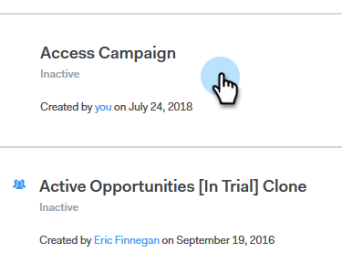
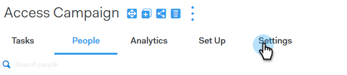

# Saltare i fine settimana {#skip-weekends}

Durante l’automazione di una campagna, probabilmente non vorrai che le e-mail vengano inviate di sabato o domenica. In caso contrario, puoi saltare i fine settimana.

1. In [!DNL Sales Connect], fare clic sulla scheda **[!UICONTROL &#x200B; Campaigns]**.

   

1. Individua e seleziona la campagna.

   

1. Fai clic su **[!UICONTROL Settings]**.

   

1. Selezionare la casella di controllo **[!UICONTROL Skip weekends]**.

   

   >[!NOTE]
   >
   >Senza saltare i fine settimana, le e-mail vengono pianificate in base a una settimana regolare di 7 giorni.
