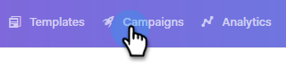

# Ignora fine settimana {#skip-weekends}

Quando automatizzate una campagna, probabilmente non vorrete che le vostre e-mail vengano inviate il sabato o la domenica. In caso contrario, è possibile saltare i fine settimana.

1. In Sales Connect, fare clic sul pulsante **Campagne** scheda .

   

1. Individua e seleziona la campagna.

   

1. Fai clic su **Impostazioni**.

   

1. Seleziona la **Ignora fine settimana** casella di controllo.

   

   >[!NOTE]
   >
   >Senza saltare i fine settimana, le tue e-mail sono pianificate in base a una normale settimana di 7 giorni.
