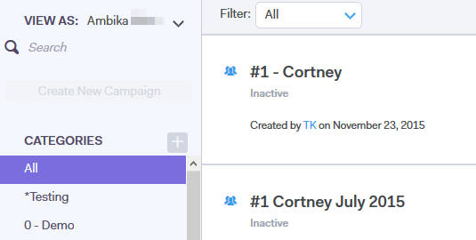

# Visualizza elenco campagne come altro utente {#view-campaigns-list-as-another-user}

In qualità di Amministratore, puoi visualizzare le campagne come qualsiasi utente.

>[!NOTE]
>
>**Autorizzazioni amministratore richieste**

1. Nell’applicazione web, fai clic su **Campagne**.

   

1. Fai clic su **Visualizza come** e selezionare l&#39;utente desiderato.

   

1. Stai visualizzando le campagne come utente selezionato.

   

   >[!NOTE]
   >
   >È inoltre possibile utilizzare i filtri o la funzione di ricerca insieme a Visualizza come per visualizzare ciò che è più rilevante per te.
