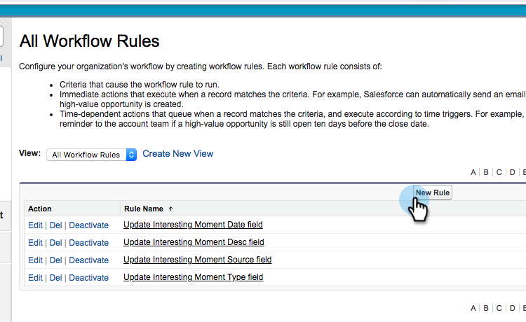
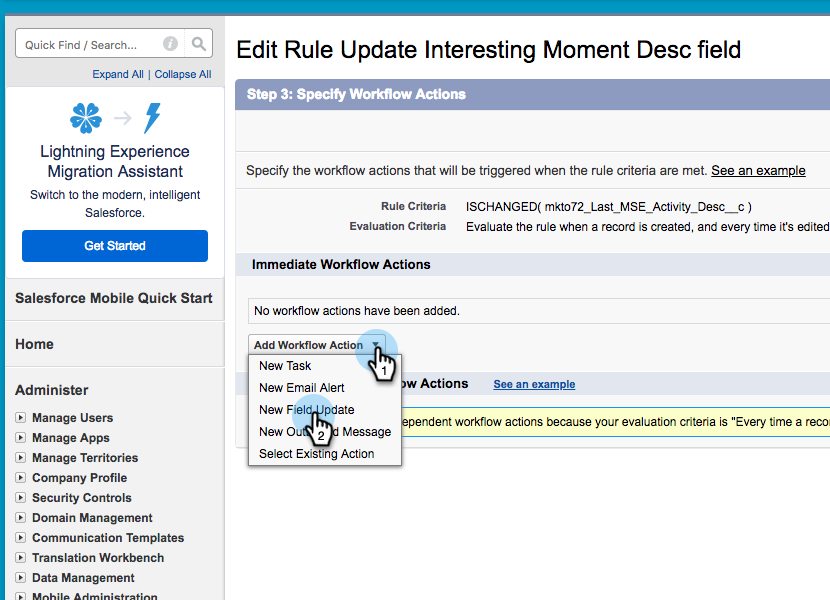

# Creazione di regole del flusso di lavoro in Salesforce {#creating-workflow-rules-in-salesforce}

Quando si utilizzano in parallelo Marketo Sales Insight (MSI) e Marketo Sales Connect (MSC), la funzionalità MSI Best Bets in Salesforce non verrà aggiornata. Tutte le altre funzioni MSI funzionano normalmente (visualizzazione di momenti interessanti nell’iFrame, invio di e-mail, aggiunta a campagne, ecc.). Questo articolo offre una soluzione per far funzionare di nuovo Best Bets.

>[!NOTE]
>
>Questo interessa solo i clienti che utilizzano **entrambi** MSI e MSE, e che vogliono utilizzare la funzionalità Best Bets in MSI. Se non hai bisogno/utilizza Best Bets, puoi ignorarlo.

## Introduzione {#getting-started}

La soluzione include la creazione di nuove regole del flusso di lavoro per copiare i valori dai nuovi campi MSE nei vecchi campi MSI. Sarà necessario creare quattro regole del flusso di lavoro per l&#39;oggetto Contact e le stesse quattro regole del flusso di lavoro per l&#39;oggetto Lead nella propria istanza Salesforce. Questo potrebbe richiedere l&#39;utilizzo dei diritti di amministratore del sistema di gestione delle relazioni con i clienti (a seconda del ruolo e della configurazione nel sistema di gestione delle relazioni con i clienti).

Di seguito sono riportati i nomi consigliati delle regole del flusso di lavoro e la relativa descrizione. Si applicano all&#39;oggetto Contatto e lead:

<table> 
 <colgroup> 
  <col> 
  <col> 
 </colgroup> 
 <tbody> 
  <tr> 
   <td>Aggiorna il campo dec del momento interessante</td> 
   <td>
Copia da: Ultimo Marketo Engagement Desc Copia in: Desc dell'ultimo momento interessante
</td> 
  </tr> 
  <tr> 
   <td>Aggiorna campo Interessante Tipo di momento</td> 
   <td>
Copia da: Ultimo tipo di coinvolgimento Marketo Copia in: Ultimo tipo di momento interessante
</td> 
  </tr> 
  <tr> 
   <td>Aggiorna campo Origine momento interessante</td> 
   <td>
Copia da: Ultima origine di coinvolgimento Marketo Copia in: Ultima origine momento interessante
</td> 
  </tr> 
  <tr> 
   <td>Aggiorna il campo Data momento interessante</td> 
   <td>
Copia da: Data ultimo coinvolgimento Marketo Copia in: Data ultimo momento interessante
</td> 
  </tr> 
 </tbody> 
</table>

## Istruzioni {#instructions}

1. Dopo aver fatto clic su **Configurazione**, cerca **Flusso di lavoro** e seleziona **Regole del flusso di lavoro**.

   

1. Seleziona **Nuova regola**.

   

1. Fai clic sull’elenco a discesa Oggetto e seleziona **Lead**, quindi fai clic su **Successivo**.

   

1. Inserisci &quot;Aggiorna campo di descrizione del momento interessante&quot; come nome della regola. Selezionare il pulsante di scelta **creato e ogni volta che viene modificato**. Nel menu a discesa Criteri regola , seleziona **la formula restituisce true**. Cerca e seleziona la funzione ISCHANGED . Evidenzia quindi il valore del campo predefinito e fai clic su **Inserisci campo**.

   

1. Nella finestra a comparsa &quot;Inserisci campo&quot;, scegli **Ultimo Marketo Engagement Desc** e fai clic su **Inserisci**.

   

1. Fai clic su **Salva e successivo**.

   

1. Nel menu a discesa Aggiungi azione flusso di lavoro , seleziona **Nuovo aggiornamento del campo**.

   

1. Nel campo Nome , immetti &quot;Aggiorna campo di descrizione del momento interessante&quot; (il nome univoco verrà generato automaticamente). Nel menu a discesa Campo da aggiornare , scegli **Desc dell&#39;ultimo momento interessante**. Seleziona la **Utilizzare una formula per impostare un nuovo valore** pulsante di scelta, quindi fai clic su **Mostra Editor formule**.

   

1. Fai clic sul pulsante **Inserisci campo** pulsante .

   

1. Seleziona **Ultimo Marketo Engagement Desc** e fai clic su **Inserisci**. Nella pagina successiva, fai clic su **Salva**.

   

1. Fai clic su **Fine**.

   

1. Fai clic su **Attiva** per attivare la regola del flusso di lavoro.

   

   Dopo l’ultimo passaggio, puoi scegliere di clonare la regola del flusso di lavoro per gli altri campi elencati nella sezione Introduzione : Desc, Tipo, Origine, Data. Dopo aver completato le quattro regole del flusso di lavoro nell’oggetto Contatto, ripetere lo stesso per l’oggetto Lead.
