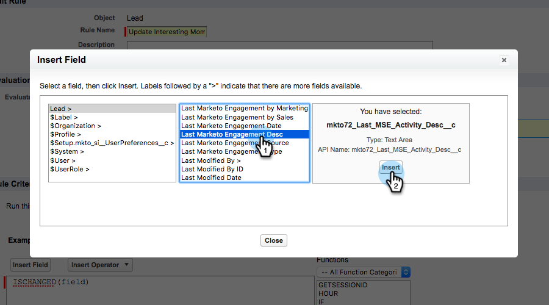
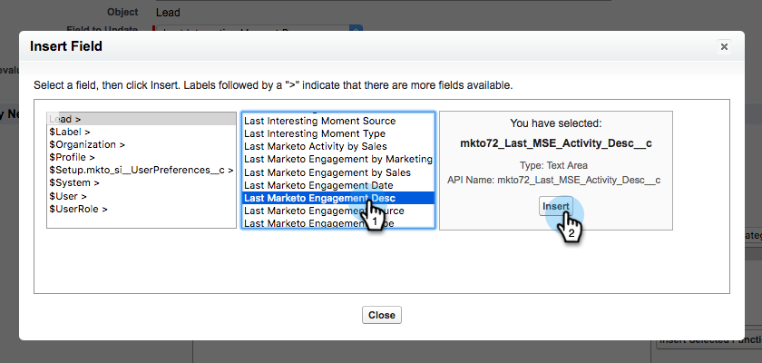

# Creazione di regole del flusso di lavoro in Salesforce {#creating-workflow-rules-in-salesforce}

Se si utilizzano in parallelo Marketo Sales Insight (MSI) e Marketo Sales Connect (MSC), la funzionalità MSI Elementi di maggiore rilevanza in [!DNL Salesforce] non verrà aggiornata. Tutte le altre funzioni MSI funzionano normalmente (visualizzazione di momenti interessanti nell’iFrame, invio di e-mail, aggiunta a campagne, ecc.). Questo articolo offre una soluzione alternativa per far funzionare di nuovo gli elementi di maggiore rilevanza.

>[!NOTE]
>
>Questo interessa solo i clienti che utilizzano **entrambi** MSI e MSE e che desiderano utilizzare la funzionalità Elementi di maggiore rilevanza in MSI. Se non hai bisogno/utilizza gli elementi di maggiore rilevanza, puoi ignorarli.

## Guida introduttuva {#getting-started}

La soluzione alternativa include la creazione di nuove regole del flusso di lavoro per copiare i valori dai nuovi campi MSE nei vecchi campi MSI. È necessario creare quattro regole del flusso di lavoro per l&#39;oggetto Contact e le stesse quattro regole del flusso di lavoro per l&#39;oggetto Lead nella propria istanza [!DNL Salesforce]. Potrebbe essere necessario disporre dei diritti di amministratore CRM (a seconda del ruolo e della configurazione in CRM).

Di seguito sono riportati i nomi consigliati delle regole del flusso di lavoro e le relative descrizioni. Questi sono applicabili all&#39;oggetto [!UICONTROL Contact] e [!UICONTROL Lead]:

<table>
 <colgroup>
  <col>
  <col>
 </colgroup>
 <tbody>
  <tr>
   <td>Aggiorna campo descrizione momento di interesse</td>
   <td>
Copia da: Ultima descrizione Marketo Engagement Copia in: Ultima descrizione momento di interesse
</td>
  </tr>
  <tr>
   <td>Aggiorna il campo del tipo di momento di interesse</td>
   <td>
Copia da: Ultimo tipo di coinvolgimento Marketo Copia in: Ultimo tipo di momento di interesse
</td>
  </tr>
  <tr>
   <td>Aggiorna il campo Source del momento di interesse</td>
   <td>
Copia da: Ultimo Marketo Engagement Source Copia in: Ultimo momento di interesse Source
</td>
  </tr>
  <tr>
   <td>Aggiorna il campo Data momento di interesse</td>
   <td>
Copia da: Data ultimo coinvolgimento Marketo Copia in: Data ultimo momento di interesse
</td>
  </tr>
 </tbody>
</table>

## Istruzioni {#instructions}

1. Dopo aver fatto clic su **[!UICONTROL Setup]**, cerca **Workflow** e seleziona **[!UICONTROL Workflow Rules]**.

   

1. Seleziona **[!UICONTROL New Rule]**.

   

1. Fare clic sul menu a discesa [!UICONTROL Object] e selezionare **[!UICONTROL Lead]**, quindi fare clic su **[!UICONTROL Next]**.

   

1. Immettere &quot;Aggiorna campo descrizione momento di interesse&quot; come [!UICONTROL Rule Name]. Selezionare il pulsante di opzione **[!UICONTROL created, and every time it’s edited]**. Nel menu a discesa [!UICONTROL Rule Criteria], seleziona **[!UICONTROL formula evaluates to true]**. Cercare e selezionare la funzione ISCHANGED. Quindi, evidenziare il valore del campo predefinito e fare clic su **[!UICONTROL Insert Field]**.

   

1. Nel popup &quot;[!UICONTROL Insert Field]&quot;, scegli **[!UICONTROL Last Marketo Engagement Desc]** e fai clic su **[!UICONTROL Insert]**.

   

1. Fai clic su **[!UICONTROL Save & Next]**.

   

1. Nel menu a discesa [!UICONTROL Add Workflow Action], selezionare **[!UICONTROL New Field Update]**.

   

1. Nel campo [!UICONTROL Name], immettere &quot;Aggiorna campo descrizione momento di interesse&quot; ([!UICONTROL Unique Name] verrà generato automaticamente). Nel menu a discesa [!UICONTROL Field to Update], scegli **[!UICONTROL Last Interesting Moment Desc]**. Selezionare il pulsante di opzione **[!UICONTROL Use a formula to set new value]**, quindi fare clic su **[!UICONTROL Show Formula Editor]**.

   

1. Fare clic sul pulsante **[!UICONTROL Insert Field]**.

   

1. Selezionare **[!UICONTROL Last Marketo Engagement Desc]** e fare clic su **[!UICONTROL Insert]**. Nella pagina successiva, fare clic su **[!UICONTROL Save]**.

   

1. Fai clic su **[!UICONTROL Done]**.

   

1. Fare clic su **[!UICONTROL Activate]** per attivare la regola del flusso di lavoro.

   

   Dopo l&#39;ultimo passaggio, è possibile scegliere di clonare la regola del flusso di lavoro per gli altri campi elencati nella sezione [!UICONTROL Getting Started]: Desc, Type, Source, Date. Dopo aver completato le quattro regole del flusso di lavoro nell&#39;oggetto [!UICONTROL Contact], ripetere la stessa operazione per l&#39;oggetto [!UICONTROL Lead].
