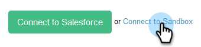

# Come collegare le vendite alla Sandbox Salesforce {#how-to-connect-sales-connect-to-your-salesforce-sandbox}

>[!PREREQUISITES]
>
>Impossibile collegare l&#39;account Sales Connect a Salesforce quando si stabilisce una connessione alla sandbox. Se lo è, [assicurati di disconnetterti](/help/marketo/product-docs/marketo-sales-connect/crm/salesforce-integration/disconnect-salesforce-from-your-sales-connect-account.md) prima di seguire i passaggi descritti in questo articolo.

1. In Sales Connect, fai clic sull&#39;icona dell&#39;ingranaggio in alto a destra e seleziona **Impostazioni**.

   

1. In Integrazioni, fai clic su **CRM**.

   

1. Nella scheda Salesforce, fai clic su **Ulteriori informazioni**.

   

1. Nella parte inferiore della pagina, fai clic su **Connetti a sandbox**.

   

   >[!NOTE]
   >
   >Se hai già effettuato l’accesso al tuo account Sandbox Salesforce, verrai indirizzato a una pagina Autorizzazione in cui dovrai consentire l’accesso. Se non hai già effettuato l&#39;accesso, procedi al passaggio 5.

1. Immetti il nome utente e la password dell&#39;account Salesforce Sandbox.

   

>[!MORELIKETHIS]
>
>[Come installare le personalizzazioni nella Sandbox Salesforce](/help/marketo/product-docs/marketo-sales-connect/crm/salesforce-customization/how-to-install-customizations-in-your-salesforce-sandbox.md)
