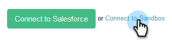

# Come collegare Sales Connect alla sandbox Salesforce {#how-to-connect-sales-connect-to-your-salesforce-sandbox}

>[!PREREQUISITES]
>
>Impossibile connettere l&#39;account [!DNL  Sales Connect] a [!DNL Salesforce] quando si stabilisce una connessione alla sandbox. In caso affermativo, [assicurati di disconnetterti](/help/marketo/product-docs/marketo-sales-connect/crm/salesforce-integration/disconnect-salesforce-from-your-sales-connect-account.md) prima di seguire i passaggi descritti in questo articolo.

1. In [!DNL Sales Connect], fare clic sull&#39;icona ingranaggio in alto a destra e selezionare **[!UICONTROL Settings]**.

   

1. In [!UICONTROL Integrations], fare clic su **[!UICONTROL CRM]**.

   

1. Nella scheda [!DNL Salesforce], fai clic su **[!UICONTROL More Info]**.

   

1. Nella parte inferiore della pagina fare clic su **[!UICONTROL Connect to Sandbox]**.

   

   >[!NOTE]
   >
   >Se hai già effettuato l&#39;accesso al tuo account [!DNL Salesforce Sandbox], verrà visualizzata una pagina di autorizzazione in cui dovrai consentire l&#39;accesso. Se non hai già effettuato l’accesso, procedi al passaggio 5.

1. Immettere il nome utente e la password dell&#39;account [!DNL Salesforce Sandbox].

   

>[!MORELIKETHIS]
>
>[Come installare le personalizzazioni nella sandbox di Salesforce](/help/marketo/product-docs/marketo-sales-connect/crm/salesforce-customization/how-to-install-customizations-in-your-salesforce-sandbox.md)
